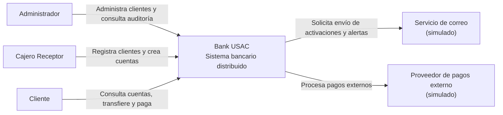
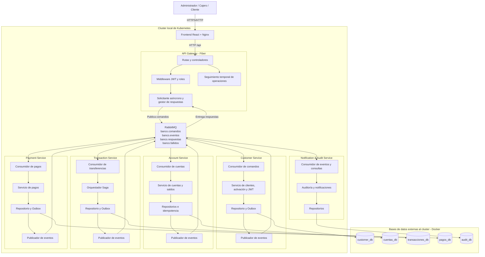
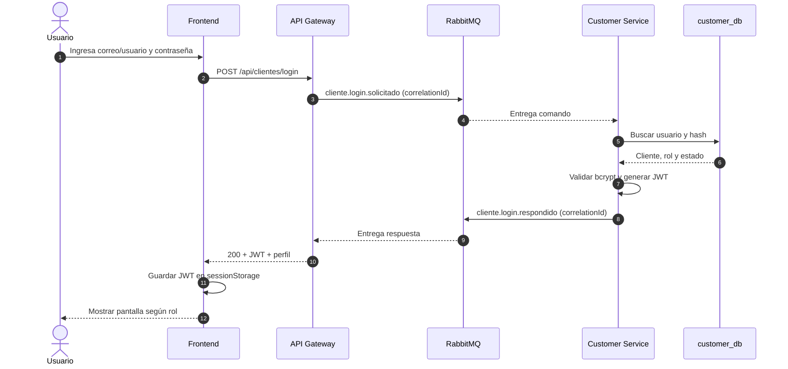
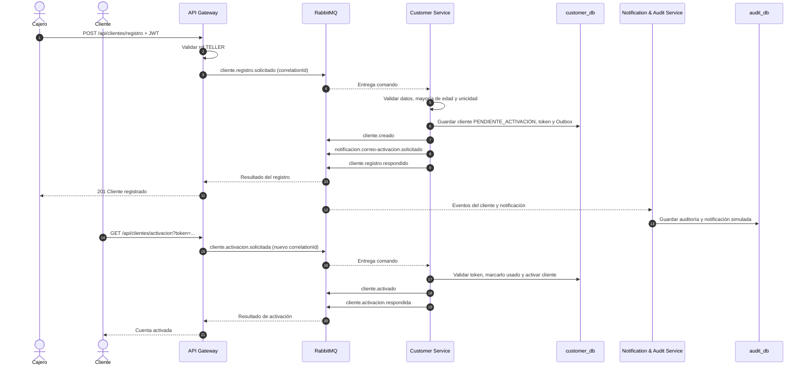
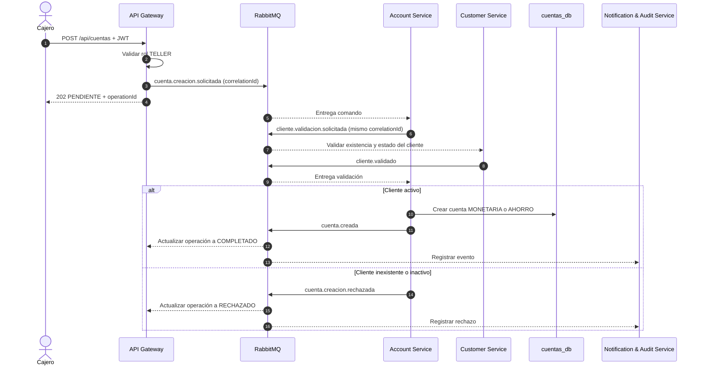
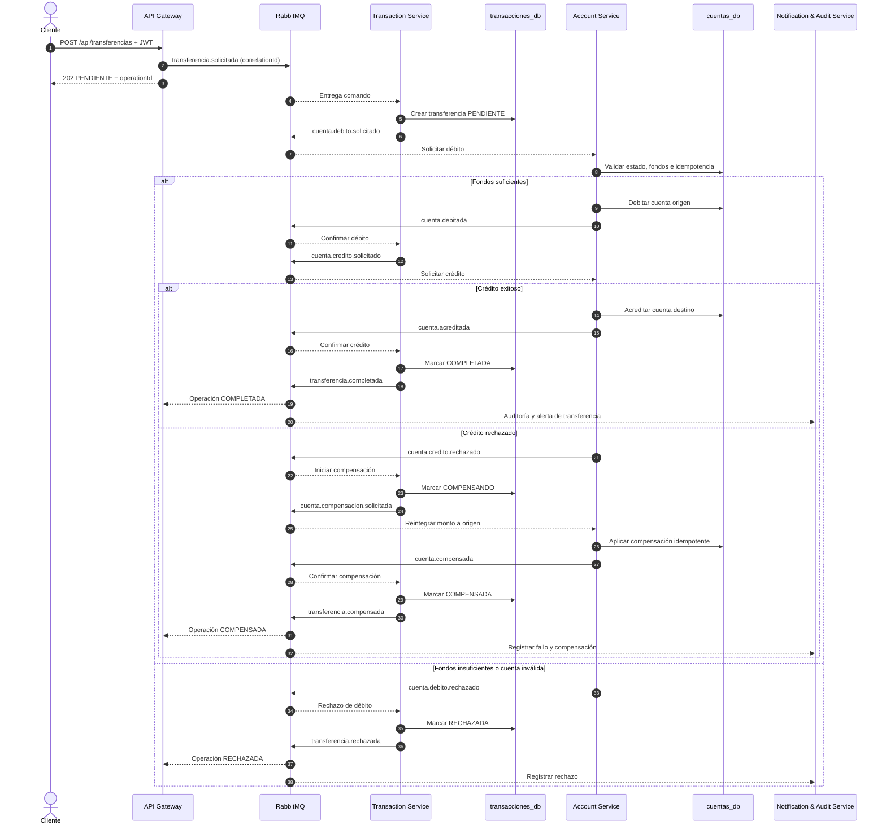
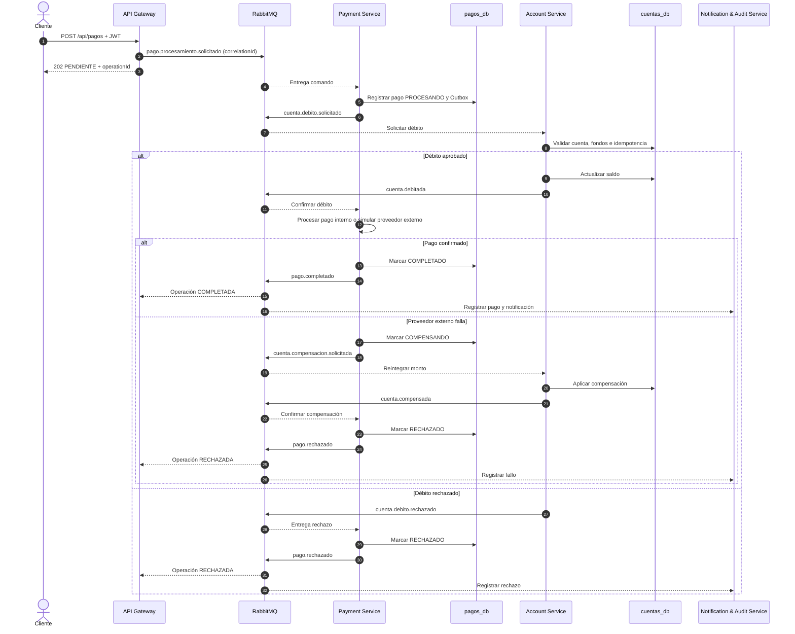

# Diagramas de secuencia y C4 - Bank USAC

Los diagramas de este documento representan la arquitectura implementada y las restricciones del enunciado: cinco microservicios, API Gateway como punto de entrada, RabbitMQ para comunicación asíncrona, una base de datos independiente por servicio, Saga para transferencias y conservación del `correlationId`.

> Nota de nomenclatura: en el modelo C4, el diagrama de contexto corresponde al Nivel 1 y el diagrama de componentes al Nivel 3. Se incluyen ambos para cubrir la solicitud “Diagrama de Contexto (C4 - Nivel 3)”.

## Diagrama de contexto - C4 Nivel 1

## Vista de componentes - C4 Nivel 3 consolidado

La comunicación HTTP termina en el API Gateway. Las flechas entre RabbitMQ y los microservicios representan comandos, eventos o respuestas asíncronas; no existen llamadas HTTP de negocio entre servicios.

## Secuencia 1 - Autenticación y emisión de JWT

## Secuencia 2 - Registro y activación de cliente

## Secuencia 3 - Creación de cuenta bancaria

## Secuencia 4 - Transferencia bancaria con Saga

## Secuencia 5 - Procesamiento de pago

## Convenciones

- Todas las publicaciones conservan el mismo `correlationId` durante un flujo distribuido.
- Los comandos se publican en `banco.comandos`.
- Los eventos de negocio se publican en `banco.eventos`.
- Las respuestas asíncronas de Customer y Audit se publican en `banco.respuestas`.
- Los mensajes no recuperables se trasladan a `banco.fallidos` y sus colas DLQ.
- Cada consumidor aplica idempotencia antes de modificar su propia base de datos.
- Ningún microservicio consulta la base de datos de otro servicio.
