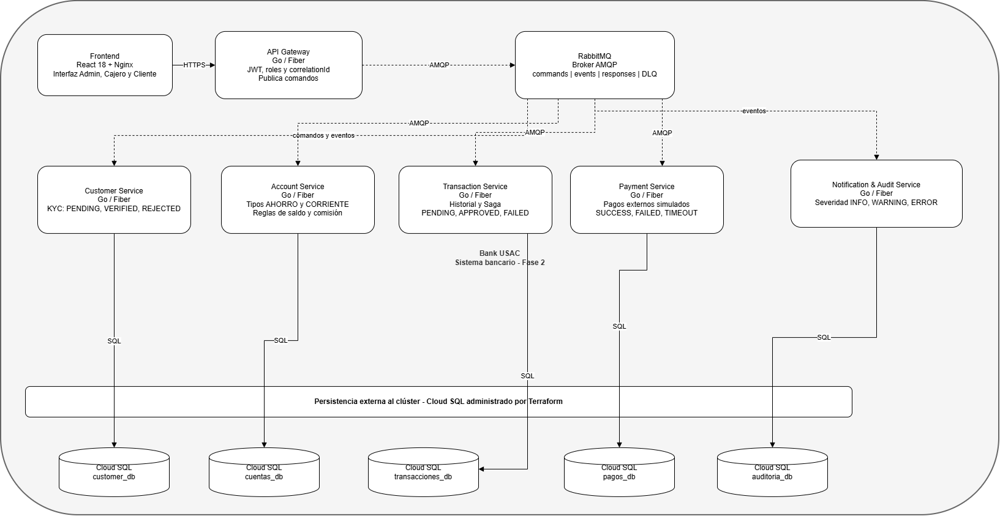

# C4 — Contenedores (Fase 2)

> **Nota de Fase 2:** Este documento actualiza la vista de contenedores C4 (Nivel 2) para reflejar los cambios introducidos en la segunda fase del proyecto: nuevas capacidades funcionales en los cinco microservicios, despliegue en GKE y bases de datos en VMs de GCP.

---

## Propósito

El diagrama de contenedores (C4, nivel 2) descompone el sistema Bank USAC en las aplicaciones y almacenes de datos que colaboran para cumplir los flujos bancarios. A diferencia del diagrama de contexto, aquí se muestran los cinco microservicios, el frontend, el API Gateway, RabbitMQ y las bases de datos independientes, junto con sus nuevas responsabilidades de Fase 2.

---

## Diagrama de contenedores

## Contenedores de aplicación

### Frontend (React 18 + Nginx)

- **Responsabilidad:** Interfaz de usuario para tres roles: Administrador, Cajero Receptor y Cliente.
- **Tecnología:** React 18, Nginx como servidor estático.
- **Despliegue Fase 2:** Cloud Run (GCP) o VM con Nginx — no en S3 ni almacenamiento estático puro.
- **Interacción:** Única capa que el usuario final toca; se comunica exclusivamente con el API Gateway vía HTTPS.

---

### API Gateway (Go/Fiber)

- **Responsabilidad:** Punto de entrada HTTP único. Valida JWT, roles y propiedad de recursos; publica comandos en RabbitMQ con `correlationId`; devuelve respuestas correlacionadas.
- **Tecnología:** Go 1.22+, Fiber v2.
- **Sin lógica de dominio:** No contiene reglas del negocio bancario. Enruta y delega.
- **Fase 2:** Expone nuevos endpoints para gestión KYC, tipos de cuenta, historial de transacciones filtrado, pagos externos y clasificación de auditoría por severidad.

---

### Customer Service (Go/Fiber) ★ KYC

- **Responsabilidad:** Gestión de clientes, usuarios, activación por correo y autenticación JWT.
- **Fase 2 — KYC:** Registra y actualiza el estado de validación del cliente: `PENDING → VERIFIED | REJECTED`. Solo clientes en estado `VERIFIED` pueden iniciar transferencias. Publica evento `customer.kyc.updated` al cambiar de estado.
- **Base de datos:** `customer_db` en `vm-db-customer`.
- **Comunicación:** Publica eventos vía Outbox → RabbitMQ. Consume: `customer.created`.

---

### Account Service (Go/Fiber) ★ Tipos de cuenta

- **Responsabilidad:** Cuentas monetarias y de ahorro, saldos, movimientos, créditos y débitos.
- **Fase 2 — Tipos de cuenta:** Soporta cuentas de tipo `AHORRO` y `CORRIENTE`. Aplica reglas: saldo mínimo por tipo, comisión por transacción (configurable). Valida límites antes de procesar débitos.
- **Base de datos:** `cuentas_db` en `vm-db-account`.
- **Comunicación:** Consume comandos de débito/crédito; publica eventos `account.debited`, `account.credited`, `account.rejected`.

---

### Transaction Service (Go/Fiber) ★ Historial

- **Responsabilidad:** Registro y estados de transferencias; coordina la Saga de débito, crédito, compensación y rechazo.
- **Fase 2 — Historial:** Mantiene historial completo con estados intermedios `PENDING → APPROVED | FAILED`. Permite consultar historial por cuenta y filtrar por fecha y estado. Registra eventos sucesivos para trazabilidad.
- **Base de datos:** `transacciones_db` en `vm-db-transaction`.
- **Comunicación:** Inicia Saga publicando `transfer.debit.requested`; consume resultados de Account y Payment; publica `transfer.completed` o `transfer.failed`.

---

### Payment Service (Go/Fiber) ★ Pagos externos

- **Responsabilidad:** Validación y procesamiento de pagos internos o externos.
- **Fase 2 — Simulación externa:** Simula integración con sistemas externos. Genera respuestas de tres tipos: `SUCCESS`, `FAILED`, `TIMEOUT`. El timeout activa compensación en la Saga. Registra cada intento en `external_provider_log`.
- **Base de datos:** `pagos_db` en `vm-db-payment`.
- **Comunicación:** Consume `payment.process.requested`; publica `payment.completed` o `payment.failed`.

---

### Notification & Audit Service (Go/Fiber) ★ Severidad

- **Responsabilidad:** Consume todos los eventos del sistema, envía correos de activación vía SMTP y mantiene auditoría e historial completo.
- **Fase 2 — Clasificación por severidad:** Clasifica cada evento recibido en: `INFO` (operaciones normales), `WARNING` (situaciones atípicas) o `ERROR` (fallos que requieren atención). Genera notificaciones diferenciadas según el tipo. Almacena historial enriquecido con severidad, `correlation_id` y microservicio origen.
- **Base de datos:** `audit_db` en `vm-db-audit`.
- **Comunicación:** Suscriptor de todos los exchanges de eventos RabbitMQ. No publica comandos.

---

### RabbitMQ (Broker AMQP)

- **Responsabilidad:** Intermediario de mensajería asíncrona entre todos los microservicios.
- **Exchanges configurados:**

| Exchange | Tipo | Propósito |
|---|---|---|
| `commands` | Direct | Comandos dirigidos a un servicio específico |
| `events` | Topic | Eventos de dominio publicados por los servicios |
| `responses` | Direct | Respuestas correlacionadas al API Gateway |
| `dead-letter` | Fanout | Mensajes fallidos para reinspección |

- **Cada consumidor** tiene cola durable y DLQ (Dead Letter Queue) independiente.
- **Despliegue Fase 2:** Pod dedicado en GKE con `PersistentVolumeClaim` para durabilidad de colas.

---

## Bases de datos (VMs GCP)

Cada microservicio es propietario de una base PostgreSQL independiente ejecutada en una VM de Compute Engine. No existen consultas directas ni llaves foráneas entre bases de distintos servicios.

| Base de datos | VM | Microservicio |
|---|---|---|
| `customer_db` | `vm-db-customer` | Customer Service |
| `cuentas_db` | `vm-db-account` | Account Service |
| `transacciones_db` | `vm-db-transaction` | Transaction Service |
| `pagos_db` | `vm-db-payment` | Payment Service |
| `audit_db` | `vm-db-audit` | Notification & Audit |

---

## Relación con las vistas del sistema

| Vista | Documento | Alcance |
|---|---|---|
| Contexto | `c4-contexto.md` | Actores externos y sistema como caja negra |
| **Contenedores** | **este documento** | Microservicios, Gateway, RabbitMQ y bases de datos |
| Componentes | `c4-componentes.md` | Estructura interna de Transaction Service (Fase 1) y nuevos servicios (Fase 2) |
| Despliegue | `despliegue.md` | Dónde se ejecutan estos contenedores en GKE/GCP |

---

## Recorrido principal (Fase 2 — Transferencia con KYC y Saga)

1. El cliente opera desde React. El Gateway valida JWT y KYC (`VERIFIED`) antes de publicar el comando.
2. Transaction Service inicia la Saga publicando `transfer.debit.requested` con `correlationId`.
3. Account Service valida tipo de cuenta, saldo mínimo y aplica comisión si corresponde. Publica `account.debited`.
4. Payment Service procesa el pago externo (simulado). Si hay timeout, publica `payment.failed` y la Saga compensa el débito.
5. Transaction Service registra el estado final (`APPROVED` o `FAILED`) en el historial.
6. Notification & Audit clasifica el evento resultante como `INFO` o `ERROR` y registra en `audit_db`.
7. El Gateway recibe la respuesta correlacionada y la devuelve al frontend.

---

## Notas de implementación

- Las **líneas continuas** representan solicitudes HTTPS del frontend al Gateway.
- Las **líneas discontinuas** representan comandos y eventos AMQP.
- Las **conexiones a PostgreSQL** son exclusivas del microservicio propietario — nunca compartidas.
- Todos los microservicios implementan el patrón **Outbox** para garantizar exactly-once en la publicación de eventos.
