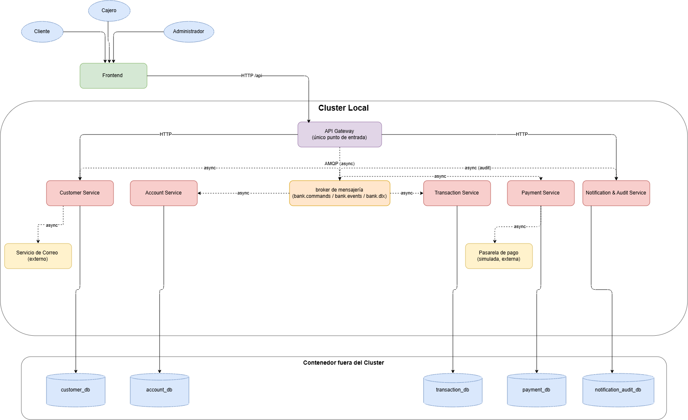

# C4 - Contenedores

## Propósito

El diagrama de contenedores (C4, nivel 2) descompone el sistema Bank USAC en las aplicaciones y almacenes de datos que colaboran para cumplir los flujos bancarios. A diferencia del diagrama de contexto, aquí se muestran los cinco microservicios, el frontend, el API Gateway, RabbitMQ y las bases de datos independientes.

## Contenedores de aplicación

- **Frontend React/Nginx:** interfaz para Administrador, Cajero Receptor y Cliente. Es el único componente que interactúa directamente con el usuario.
- **API Gateway (Go/Fiber):** punto de entrada HTTP. Valida JWT, roles y propiedad de recursos; publica comandos en RabbitMQ y devuelve respuestas correlacionadas. No contiene reglas del dominio bancario.
- **Customer Service:** clientes, usuarios, activación por correo y autenticación JWT. Mantiene su propia base de datos y publica eventos mediante Outbox.
- **Account Service:** cuentas monetarias/de ahorro, saldos, movimientos, créditos, débitos y desactivación por inactividad.
- **Transaction Service:** registro y estados de transferencias; coordina la Saga de débito, crédito, compensación y rechazo.
- **Payment Service:** validación y procesamiento de pagos internos o externos, separado del dominio de cuentas.
- **Notification & Audit Service:** consume eventos, envía correos de activación mediante SMTP y conserva auditoría, trazabilidad e historial de notificaciones.
- **RabbitMQ:** broker AMQP con exchanges de comandos, eventos, respuestas y fallidos; cada consumidor posee una cola durable y DLQ.

## Persistencia y comunicación

Cada microservicio es propietario de una base PostgreSQL independiente ubicada fuera del clúster de Kubernetes. No existen consultas directas ni llaves foráneas entre bases. La comunicación de negocio entre microservicios es asíncrona mediante RabbitMQ; los puertos HTTP internos se reservan para salud y operación.

Las líneas continuas representan solicitudes del navegador al Gateway. Las líneas discontinuas representan comandos y eventos AMQP. Las conexiones a PostgreSQL representan la persistencia exclusiva del microservicio propietario.

## Recorrido principal

El usuario opera desde React, el Gateway publica un comando con `correlationId`, el microservicio responsable procesa el mensaje y escribe en su base. El resultado se publica como evento; el Gateway actualiza el seguimiento de la operación y Notification & Audit registra el evento. En transferencias, los eventos sucesivos forman una Saga de coreografía y los fallos generan compensaciones.
