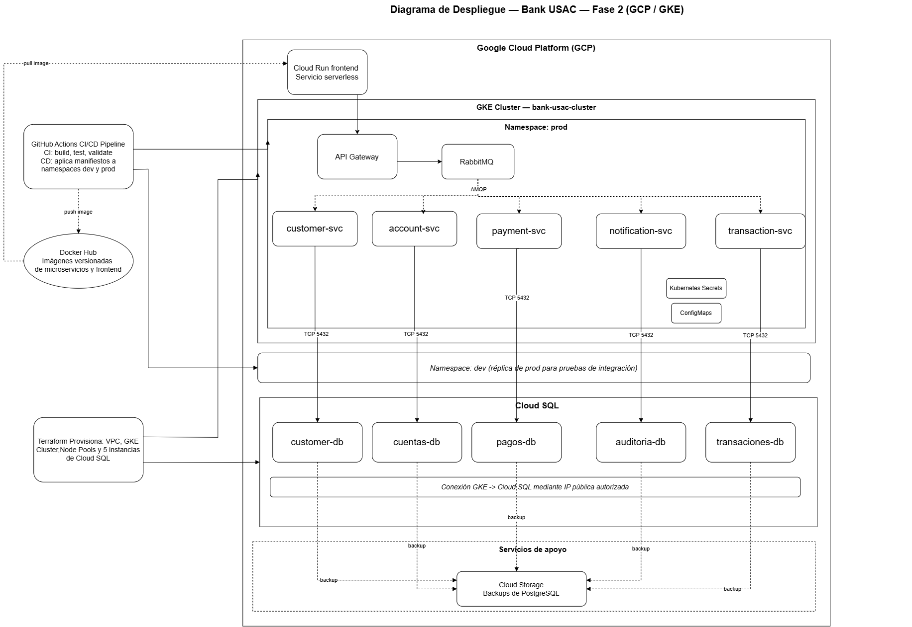

# Diagrama de despliegue

El presente documento describe el despliegue de **Bank USAC** durante la Fase 2. La solución utiliza Google Cloud, un clúster administrado de Google Kubernetes Engine (GKE), RabbitMQ para comunicación asíncrona y cinco instancias independientes de Cloud SQL para PostgreSQL.



## 1. Vista general

El sistema está dividido en tres capas principales:

1. **Infraestructura cloud**, provisionada mediante Terraform.
2. **Componentes de aplicación**, desplegados dentro de Kubernetes.
3. **Persistencia**, proporcionada por instancias independientes de Cloud SQL.

El usuario accede al frontend mediante un navegador. El frontend se comunica con el punto de entrada del backend y las operaciones de negocio se procesan mediante los microservicios. La comunicación entre servicios utiliza RabbitMQ y los microservicios acceden exclusivamente a la instancia de base de datos correspondiente a su dominio.

Las bases de datos no se ejecutan dentro de Kubernetes. Se utiliza Cloud SQL como servicio administrado de PostgreSQL, con una instancia independiente por microservicio.

## 2. Componentes principales

| Componente | Tecnología | Administración |
|---|---|---|
| Red virtual | Google VPC | Terraform |
| Subred | Google VPC Subnet | Terraform |
| Clúster de contenedores | Google Kubernetes Engine | Terraform |
| Nodos del clúster | GKE Node Pool | Terraform |
| Microservicios | Contenedores Docker | Kubernetes y CI/CD |
| Mensajería | RabbitMQ | Kubernetes |
| Bases de datos | Cloud SQL para PostgreSQL | Terraform y Google Cloud |
| Imágenes | Registry de contenedores | CI/CD |
| Frontend | React y Nginx | Kubernetes o servicio cloud |
| Autoescalado | Horizontal Pod Autoscaler | Kubernetes |

## 3. Entornos de despliegue

Los ambientes se separan mediante namespaces dentro del clúster Kubernetes:

| Namespace | Propósito | Despliegue |
|---|---|---|
| `dev` | Integración y validación de funcionalidades | Merge hacia `develop` |
| `prod` | Ambiente productivo | Merge hacia `main` o `master` |

Las imágenes de producción se generan y publican durante el proceso de release. No se deben utilizar imágenes con la etiqueta `latest`.

## 4. Provisionamiento mediante Terraform

Terraform se utiliza como herramienta de Infraestructura como Código para provisionar la infraestructura base de Google Cloud. El código se encuentra en:

```text
infrastructure/terraform/
```

| Recurso | Archivo | Descripción |
|---|---|---|
| APIs de Google Cloud | `provider.tf` | Habilita las APIs requeridas |
| VPC | `network.tf` | Crea la red `bank-usac-vpc` |
| Subred | `network.tf` | Crea la subred utilizada por la infraestructura |
| Firewall | `network.tf` | Define reglas de acceso de red |
| Instancias de base de datos | `cloud-sql.tf` | Crea cinco instancias independientes de Cloud SQL |
| Bases de datos | `cloud-sql.tf` | Crea una base de datos por instancia |
| Usuarios | `cloud-sql.tf` | Crea un usuario por base de datos |
| Clúster GKE | `gke.tf` | Crea el clúster administrado de Kubernetes |
| Node pool | `gke.tf` | Crea los nodos del clúster |
| Contraseñas | `cloud-sql.tf` | Genera contraseñas aleatorias para los usuarios |

### 4.1. Recursos administrados por Terraform

Terraform administra:

- APIs de Google Cloud.
- VPC y subred.
- Reglas de firewall.
- Instancias de Cloud SQL.
- Bases de datos y usuarios.
- Contraseñas generadas para las bases de datos.
- Clúster GKE.
- Node pool de GKE.

### 4.2. Recursos administrados por Kubernetes

Kubernetes administra los recursos que se ejecutan dentro del clúster:

- Namespaces.
- Deployments.
- Services.
- RabbitMQ.
- ConfigMaps.
- Secrets.
- Ingress, si aplica.
- Probes de salud.
- Recursos de CPU y memoria.
- Horizontal Pod Autoscalers.
- Rolling updates.

Terraform provisiona el clúster GKE, pero no sustituye a Kubernetes en la administración de las aplicaciones que se ejecutan dentro de él.

## 5. Clúster GKE

El clúster se crea mediante el recurso Terraform `google_container_cluster.bank_usac` y el node pool mediante `google_container_node_pool.bank_usac`.

La configuración incluye:

- Nombre configurable mediante `gke_cluster_name`.
- Zona configurable mediante `zone`.
- VPC y subred del proyecto.
- Networking VPC Native.
- Canal de lanzamiento `REGULAR`.
- Node pool administrado.
- Cantidad inicial de nodos configurable.
- Máximo de nodos configurable.
- Tipo de máquina configurable mediante `gke_machine_type`.
- Discos de nodos configurables mediante `gke_disk_size_gb`.
- Auto-reparación y actualización automática de nodos.

Las aplicaciones se despliegan posteriormente dentro de este clúster mediante manifiestos Kubernetes y el pipeline CI/CD.

## 6. Bases de datos mediante Cloud SQL

La solución utiliza Cloud SQL para PostgreSQL como servicio administrado. Cloud SQL es equivalente, para este diseño, al uso de un servicio administrado como Amazon RDS.

No se utiliza una única instancia compartida. Cada microservicio tiene una instancia independiente, su propia base de datos, su propio usuario y su propia credencial.

| Microservicio | Instancia Cloud SQL | Base de datos | Usuario |
|---|---|---|---|
| `customer-service` | `bank-usac-customer-db` | `customer_db` | `customer_user` |
| `account-service` | `bank-usac-account-db` | `cuentas_db` | `cuentas_usuario` |
| `transaction-service` | `bank-usac-transaction-db` | `transacciones_db` | `transacciones_usuario` |
| `payment-service` | `bank-usac-payment-db` | `pagos_db` | `pagos_usuario` |
| `notification-audit-service` | `bank-usac-notification-audit-db` | `auditoria_db` | `audit_user` |

Las instancias se crean con `google_sql_database_instance`, utilizando `for_each` sobre el catálogo de bases definido en `cloud-sql.tf`.

### 6.1. Configuración de Cloud SQL

Cada instancia se configura con:

- PostgreSQL 16.
- Tier configurable mediante `cloud_sql_tier`.
- Almacenamiento SSD.
- Tamaño inicial configurable mediante `cloud_sql_storage_gb`.
- Autoaumento del almacenamiento.
- Backups habilitados.
- Recuperación punto en el tiempo habilitada.
- Una base de datos por instancia.
- Un usuario por instancia.
- Contraseña generada automáticamente.

Cloud SQL se eligió porque permite mantener el aislamiento por microservicio sin administrar manualmente el sistema operativo ni la instalación del motor de base de datos. La infraestructura subyacente es administrada por Google Cloud, mientras Terraform mantiene la configuración reproducible.

### 6.2. Seguridad de conexión

La variable de ejemplo contiene:

```hcl
cloud_sql_authorized_networks = ["0.0.0.0/0"]
```

Este valor solo debe utilizarse para pruebas iniciales controladas. Antes de una entrega o despliegue real debe restringirse el acceso a las redes necesarias.

Las credenciales no deben almacenarse en el repositorio. Deben transferirse a Kubernetes mediante Secrets u otro mecanismo seguro. No se deben publicar URLs de conexión que contengan contraseñas.

## 7. Microservicios desplegados

Dentro del clúster GKE se despliegan los siguientes microservicios:

| Microservicio | Responsabilidad | Base de datos |
|---|---|---|
| `customer-service` | Clientes y estado KYC | `customer_db` |
| `account-service` | Cuentas, tipos y reglas de negocio | `cuentas_db` |
| `transaction-service` | Transferencias, historial y estados | `transacciones_db` |
| `payment-service` | Simulación de pagos externos | `pagos_db` |
| `notification-audit-service` | Notificaciones, clasificación y auditoría | `auditoria_db` |

Cada servicio debe contar con su `Deployment`, `Service`, configuración de recursos, variables de entorno, Secret de conexión, probes de salud y HPA, de acuerdo con los manifiestos del proyecto.

## 8. Comunicación asíncrona

RabbitMQ se utiliza para la comunicación asíncrona mediante AMQP.

El flujo general es:

1. El punto de entrada recibe una solicitud.
2. Se publica un comando en RabbitMQ.
3. El microservicio responsable consume el mensaje.
4. Se ejecuta la lógica de negocio.
5. El servicio modifica únicamente su propia base de datos.
6. Se publica un evento de resultado.
7. Los servicios interesados consumen el evento.
8. Se conserva el `correlationId`.
9. Se aplica idempotencia para evitar efectos duplicados.
10. Notification & Audit Service registra y clasifica los eventos.

## 9. Autoescalado mediante HPA

Cada microservicio debe implementar un Horizontal Pod Autoscaler.

La condición obligatoria es crear un nuevo pod cuando el uso de CPU alcance el 80 %, conforme a la configuración del HPA.

| Parámetro | Configuración |
|---|---|
| Recurso | Horizontal Pod Autoscaler |
| Métrica | Uso de CPU |
| Umbral | 80 % |
| Réplicas mínimas | Según el manifiesto del servicio |
| Réplicas máximas | Según el manifiesto del servicio |

Terraform administra la infraestructura del clúster y del node pool. Kubernetes administra el escalamiento de los pods de aplicación.

## 10. Registry e imágenes

El pipeline CI/CD construye y publica las imágenes de los microservicios. El proceso debe:

1. Ejecutar el build.
2. Ejecutar pruebas.
3. Ejecutar la validación del sistema.
4. Construir las imágenes Docker.
5. Etiquetar las imágenes con una versión.
6. Publicarlas en el registry.
7. Desplegar la versión correspondiente en Kubernetes.

Se deben utilizar etiquetas versionadas, por ejemplo:

```text
customer-service:1.0.0
customer-service:v1.0.0
customer-service:<commit-sha>
```

No se debe utilizar la etiqueta `latest`.

## 11. Frontend

El frontend se despliega en una opción permitida por el enunciado:

- Dentro de Kubernetes.
- En una instancia virtual.
- En un servicio cloud como Google Cloud Run.

No se utiliza Amazon S3 como hosting del frontend.

La documentación definitiva debe indicar la tecnología, URL, variables de entorno, proceso de construcción y proceso de despliegue.

## 12. Flujo CI/CD

### 12.1. Rama `feature`

Para ramas con formato `feature/<nombre-funcionalidad>` se ejecutan:

- Build.
- Test.
- Validación o sanity check.

Si alguna etapa falla, el pipeline se detiene.

### 12.2. Rama `develop`

Después del merge hacia `develop` se ejecutan nuevamente las validaciones y posteriormente:

- Construcción de imágenes Docker.
- Etiquetado de imágenes.
- Publicación de imágenes.
- Despliegue en el namespace `dev`.

### 12.3. Release

La entrega formal se realiza mediante `release/<version>` o mediante un tag con formato `vX.X.X`.

Durante esta etapa se genera la versión, se construyen las imágenes finales, se etiquetan y se publican en el registry.

### 12.4. Producción

El despliegue a producción se realiza después del merge hacia `main` o `master`. El pipeline utiliza las imágenes previamente publicadas, actualiza los deployments y ejecuta un rolling update.

## 13. Recorrido de una operación

1. El usuario realiza una acción desde el navegador.
2. La solicitud llega al frontend.
3. El frontend se comunica con el punto de entrada del backend.
4. El API Gateway publica un comando en RabbitMQ.
5. El microservicio responsable consume el mensaje.
6. Se validan las reglas de negocio y el estado de la operación.
7. El microservicio accede exclusivamente a su instancia de Cloud SQL.
8. Se actualiza el estado de la operación.
9. Se publica el evento correspondiente.
10. Los consumidores interesados procesan el evento.
11. Se conserva el `correlationId`.
12. Se aplica idempotencia.
13. Notification & Audit Service registra el resultado.
14. El frontend muestra el resultado al usuario.

## 14. Diferencias con la Fase 1

| Aspecto | Fase 1 | Fase 2 |
|---|---|---|
| Kubernetes | Entorno local | Clúster GKE administrado en Google Cloud |
| Bases de datos | Entorno local | Cinco instancias independientes de Cloud SQL |
| Ubicación de las bases | Host local o contenedores locales | Fuera de Kubernetes, en Cloud SQL |
| Entornos | Entorno local | Namespaces `dev` y `prod` |
| Provisionamiento | Manual o local | Terraform |
| Despliegue | Manual o semi-manual | Pipeline CI/CD |
| Autoescalado | No implementado | HPA al 80 % de CPU |
| Registry | No requerido | Registry con imágenes versionadas |
| Comunicación | Microservicios | Comunicación asíncrona mediante RabbitMQ |
| Trazabilidad | Básica | `correlationId`, idempotencia y auditoría |

## 15. Resumen de responsabilidades

```text
Terraform
├── APIs de Google Cloud
├── VPC y subred
├── Firewall
├── Cinco instancias Cloud SQL
├── Cinco bases de datos PostgreSQL
├── Usuarios y credenciales de base de datos
├── Clúster GKE
└── Node pool

Kubernetes
├── Namespaces dev y prod
├── Frontend
├── API Gateway
├── RabbitMQ
├── Customer Service
├── Account Service
├── Transaction Service
├── Payment Service
├── Notification & Audit Service
├── Services
├── Secrets y ConfigMaps
├── HPA
└── Rolling updates

CI/CD
├── Build
├── Test
├── Validación
├── Construcción de imágenes
├── Etiquetado
├── Publicación en registry
├── Despliegue en dev
└── Despliegue automatizado en producción
```

## 16. Aclaración arquitectónica final

Terraform provisiona la infraestructura base de Google Cloud, incluyendo la red, el clúster GKE, el node pool y las cinco instancias independientes de Cloud SQL.

Kubernetes administra los componentes de aplicación que se ejecutan dentro del clúster, y el pipeline CI/CD automatiza la construcción, publicación y actualización de las aplicaciones.

Cloud SQL se utiliza como servicio administrado de PostgreSQL. Por lo tanto, las bases de datos no se ejecutan dentro de Kubernetes ni se utiliza una única base de datos compartida por todos los microservicios.

La arquitectura mantiene el aislamiento por dominio mediante una instancia independiente de Cloud SQL para cada microservicio.
