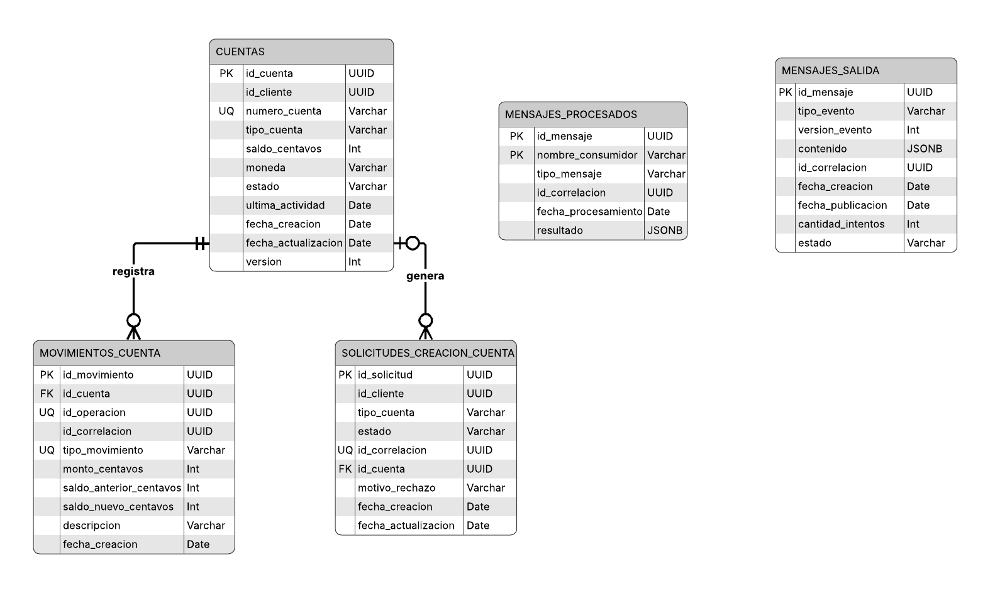

# Diagrama entidad-relación — Account Service

El diagrama representa la estructura persistente administrada exclusivamente por **Account Service**. Incluye las cuentas bancarias, sus movimientos, las solicitudes de creación y las tablas técnicas utilizadas para idempotencia y publicación confiable de eventos.

## Relaciones principales

- Una cuenta puede registrar múltiples movimientos.
- Una solicitud de creación puede generar una cuenta cuando la validación del cliente finaliza correctamente.
- `id_cliente` funciona como referencia lógica a Customer Service; no es una clave foránea hacia otra base de datos.
- `mensajes_procesados` evita aplicar dos veces un mismo comando.
- `mensajes_salida` implementa el patrón Transactional Outbox.

