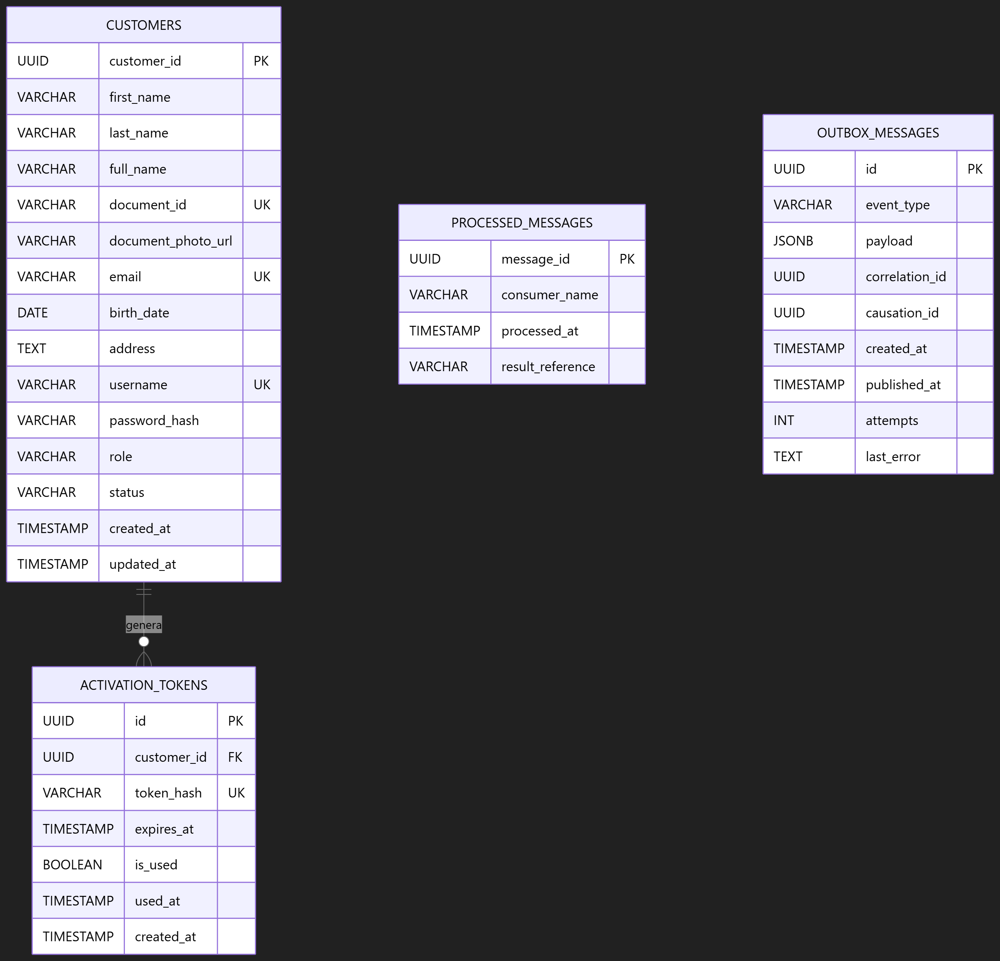

# Diagrama entidad-relación — Customer Service

El diagrama representa la estructura persistente administrada exclusivamente por **Customer Service** en la base de datos `customer_db`. Incluye la información de clientes y usuarios, los tokens de activación de un solo uso y las tablas técnicas necesarias para idempotencia y publicación confiable de eventos.

## Entidades principales

### `customers`

Almacena la información de identidad, contacto, autenticación, estado de acceso y estado KYC de cada cliente o usuario del sistema.

- `customer_id`: identificador único del cliente; clave primaria.
- `first_name`, `last_name` y `full_name`: nombres del cliente.
- `document_id`: documento de identificación único.
- `document_photo_url`: referencia segura a la fotografía del documento, cuando exista.
- `email`: correo electrónico único.
- `birth_date`: fecha de nacimiento.
- `address`: dirección del cliente.
- `username`: nombre de usuario único.
- `password_hash`: hash de la contraseña; nunca debe almacenar la contraseña en texto plano.
- `role`: rol del usuario, limitado a `ADMIN`, `TELLER` o `CLIENTE`.
- `status`: estado de acceso del usuario, limitado a `PENDIENTE_ACTIVACION`, `ACTIVO` o `BLOQUEADO`.
- `kyc_status`: estado de validación KYC del cliente (**Fase 2**); valores permitidos: `PENDING`, `VERIFIED`, `REJECTED`. Valor por defecto: `PENDING`. No puede ser nulo.
- `kyc_updated_at`: fecha y hora de la última actualización del estado KYC (**Fase 2**). Permite auditar cuándo cambió el estado.
- `created_at` y `updated_at`: fechas de creación y última actualización.

Los índices sobre `email`, `username` y `document_id` apoyan las validaciones de unicidad y las consultas frecuentes de autenticación, registro y búsqueda de clientes. El índice sobre `kyc_status` agiliza las validaciones en la Saga de transferencia.

#### Restricción de negocio (Fase 2)

El campo `kyc_status` es independiente del campo `status`. Un cliente puede estar `ACTIVO` (acceso habilitado) pero tener `kyc_status = PENDING` o `REJECTED`, lo que le impide realizar transferencias. La validación KYC se realiza siempre antes de iniciar la Saga, mediante el evento `cliente.kyc.validacion.solicitada`.

### `activation_tokens`

Almacena los tokens de activación de cuenta de un solo uso.

- `id`: identificador único del token; clave primaria.
- `customer_id`: clave foránea hacia `customers.customer_id`.
- `token_hash`: hash único del token de activación.
- `expires_at`: fecha y hora de expiración.
- `is_used`: indica si el token ya fue utilizado.
- `used_at`: fecha y hora en que se utilizó el token, cuando corresponda.
- `created_at`: fecha y hora de creación.

El token se almacena como hash y no como valor original. El índice compuesto sobre `token_hash`, `is_used` y `expires_at` permite localizar y validar el token durante el proceso de activación.

## Relación principal

- Un registro de `customers` puede tener **cero o muchos** registros en `activation_tokens`.
- Cada registro de `activation_tokens` pertenece a **un único** cliente mediante `customer_id`.
- Si un cliente se elimina, sus tokens de activación asociados se eliminan mediante `ON DELETE CASCADE`.

$$
customers\ (1) \longrightarrow (0..N)\ activation\_tokens
$$

## Tablas técnicas

### `processed_messages`

Implementa la idempotencia de mensajes consumidos desde RabbitMQ.

- `message_id`: identificador del mensaje procesado; clave primaria.
- `consumer_name`: nombre del consumidor que procesó el mensaje.
- `processed_at`: fecha y hora de procesamiento.
- `result_reference`: referencia opcional al resultado generado.

Esta tabla evita que un mensaje entregado más de una vez provoque efectos duplicados, por ejemplo, registrar repetidamente un cliente o ejecutar nuevamente una activación.

