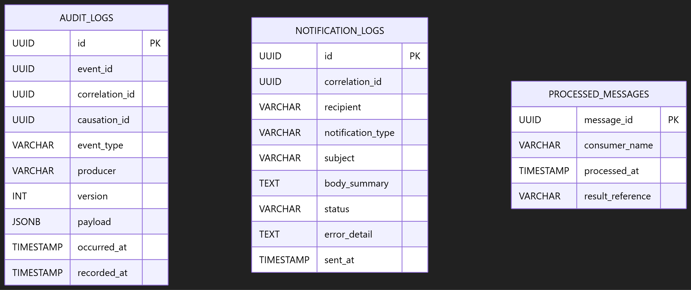

# Diagrama entidad-relación — Notification & Audit Service

El diagrama representa la estructura persistente administrada exclusivamente por **Notification & Audit Service** en la base de datos `notification_audit_db`. Incluye el registro de auditoría distribuida, el historial de notificaciones generadas o enviadas y la tabla técnica para idempotencia de mensajes.

## Entidades principales

### `audit_logs`

Registra eventos relevantes recibidos por el servicio para permitir auditoría y reconstrucción de flujos distribuidos.

- `id`: identificador único del registro de auditoría; clave primaria.
- `event_id`: identificador del evento recibido.
- `correlation_id`: identificador que agrupa todos los eventos de una misma operación distribuida.
- `causation_id`: identificador del evento que originó el evento actual, cuando aplique.
- `event_type`: tipo del evento recibido.
- `producer`: componente que publicó el evento.
- `version`: versión del contrato del evento.
- `payload`: payload seguro del evento en formato `JSONB`.
- `occurred_at`: fecha y hora en que ocurrió el evento.
- `recorded_at`: fecha y hora en que se registró en auditoría.

Los índices sobre `correlation_id`, `event_type` y `occurred_at` apoyan la consulta de trazas, filtros por tipo de evento e historial cronológico.

### `notification_logs`

Conserva el historial de notificaciones generadas o enviadas por el servicio.

- `id`: identificador único del registro de notificación; clave primaria.
- `correlation_id`: identificador de la operación asociada.
- `recipient`: correo electrónico o identificador del destinatario.
- `notification_type`: tipo de notificación, por ejemplo `ACTIVATION_EMAIL` o `TRANSFER_ALERT`.
- `subject`: asunto de la notificación.
- `body_summary`: resumen del contenido, sin credenciales ni información confidencial.
- `status`: estado de la notificación, limitado a `PENDING`, `SENT` o `FAILED`.
- `error_detail`: detalle controlado del error cuando el envío falla.
- `sent_at`: fecha y hora del envío o del intento registrado.

Los índices sobre `recipient` y `correlation_id` permiten consultar notificaciones por destinatario y relacionarlas lógicamente con una operación distribuida.

## Relaciones lógicas

No existe una llave foránea declarada entre `audit_logs` y `notification_logs`.

- Ambas tablas pueden vincularse **lógicamente** mediante `correlation_id` cuando corresponden a la misma operación.
- Un mismo `correlation_id` puede aparecer en **cero o muchos** registros de auditoría y en **cero o muchos** registros de notificaciones.
- Esta relación no se implementa como una llave foránea porque `correlation_id` identifica flujos distribuidos y no una entidad propietaria dentro de esta base de datos.

$$
correlation\_id \Rightarrow audit\_logs\ (0..N)\ 	ext{y}\ notification\_logs\ (0..N)
$$

