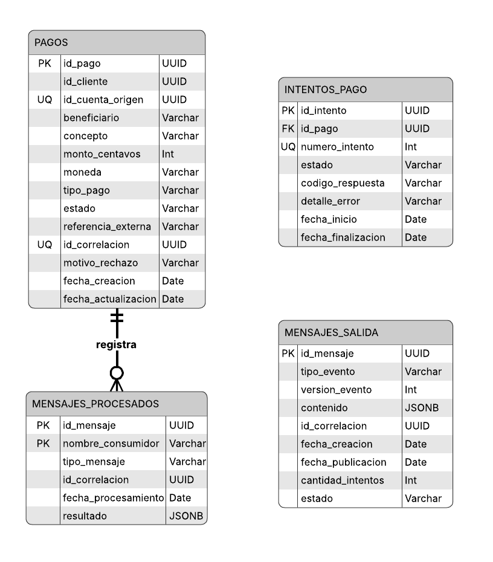

# Diagrama entidad-relación — Payment Service

El diagrama representa la estructura persistente administrada exclusivamente por **Payment Service**. Incluye los pagos, sus intentos de procesamiento y las tablas técnicas utilizadas para idempotencia y publicación confiable de eventos.

## Relaciones principales

- Un pago puede registrar múltiples intentos de procesamiento.
- Cada intento pertenece a un único pago.
- `id_cliente` e `id_cuenta_origen` son referencias lógicas a otros contextos y no claves foráneas entre bases de datos.
- `mensajes_procesados` evita procesar dos veces el mismo mensaje.
- `mensajes_salida` implementa el patrón Transactional Outbox.

## Simulación de pagos externos

La tabla `pagos` incluye el campo `resultado_simulado`, restringido a `EXITO`, `FALLO` o `TIMEOUT`. La tabla `intentos_pago` registra el resultado efectivo mediante `estado`, `codigo_respuesta`, `detalle_error`, `fecha_inicio` y `fecha_finalizacion`. Para instalaciones existentes, este campo se incorpora mediante la migración `000002_agregar_resultado_simulado` con `EXITO` como valor predeterminado.

