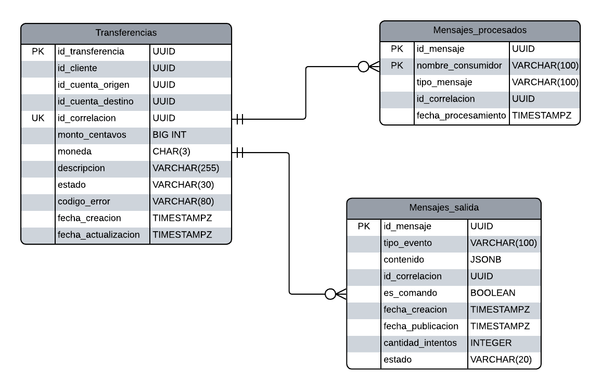

# Diagrama entidad-relación — Transaction Service

El diagrama representa la estructura persistente administrada exclusivamente por **Transaction Service**. Incluye las transferencias bancarias y las tablas técnicas utilizadas para garantizar idempotencia, trazabilidad y publicación confiable de eventos.

## Relaciones principales

- Una transferencia se identifica mediante `id_transferencia`.
- `id_cliente`, `id_cuenta_origen` e `id_cuenta_destino` funcionan como referencias lógicas a otros microservicios; no son claves foráneas hacia otras bases de datos.
- `id_correlacion` permite relacionar lógicamente la transferencia con los mensajes consumidos y publicados durante el flujo distribuido.
- `mensajes_procesados` evita procesar más de una vez el mismo mensaje y permite implementar idempotencia.
- `mensajes_salida` implementa el patrón **Transactional Outbox**, almacenando los eventos que deben publicarse en el broker.