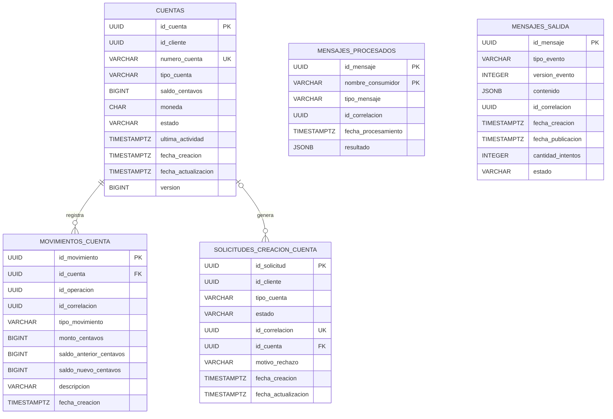

# Diagrama entidad-relación — Account Service

```mermaid
erDiagram
    CUENTAS {
        UUID id_cuenta PK
        UUID id_cliente
        VARCHAR numero_cuenta UK
        VARCHAR tipo_cuenta
        BIGINT saldo_centavos
        CHAR moneda
        VARCHAR estado
        TIMESTAMPTZ ultima_actividad
        TIMESTAMPTZ fecha_creacion
        TIMESTAMPTZ fecha_actualizacion
        BIGINT version
    }

    MOVIMIENTOS_CUENTA {
        UUID id_movimiento PK
        UUID id_cuenta FK
        UUID id_operacion
        UUID id_correlacion
        VARCHAR tipo_movimiento
        BIGINT monto_centavos
        BIGINT saldo_anterior_centavos
        BIGINT saldo_nuevo_centavos
        VARCHAR descripcion
        TIMESTAMPTZ fecha_creacion
    }

    SOLICITUDES_CREACION_CUENTA {
        UUID id_solicitud PK
        UUID id_cliente
        VARCHAR tipo_cuenta
        VARCHAR estado
        UUID id_correlacion UK
        UUID id_cuenta FK
        VARCHAR motivo_rechazo
        TIMESTAMPTZ fecha_creacion
        TIMESTAMPTZ fecha_actualizacion
    }

    MENSAJES_PROCESADOS {
        UUID id_mensaje PK
        VARCHAR nombre_consumidor PK
        VARCHAR tipo_mensaje
        UUID id_correlacion
        TIMESTAMPTZ fecha_procesamiento
        JSONB resultado
    }

    MENSAJES_SALIDA {
        UUID id_mensaje PK
        VARCHAR tipo_evento
        INTEGER version_evento
        JSONB contenido
        UUID id_correlacion
        TIMESTAMPTZ fecha_creacion
        TIMESTAMPTZ fecha_publicacion
        INTEGER cantidad_intentos
        VARCHAR estado
    }

    CUENTAS ||--o{ MOVIMIENTOS_CUENTA : registra
    CUENTAS o|--o{ SOLICITUDES_CREACION_CUENTA : genera
```

> `id_cliente` es una referencia lógica a Customer Service, no una clave foránea física.

