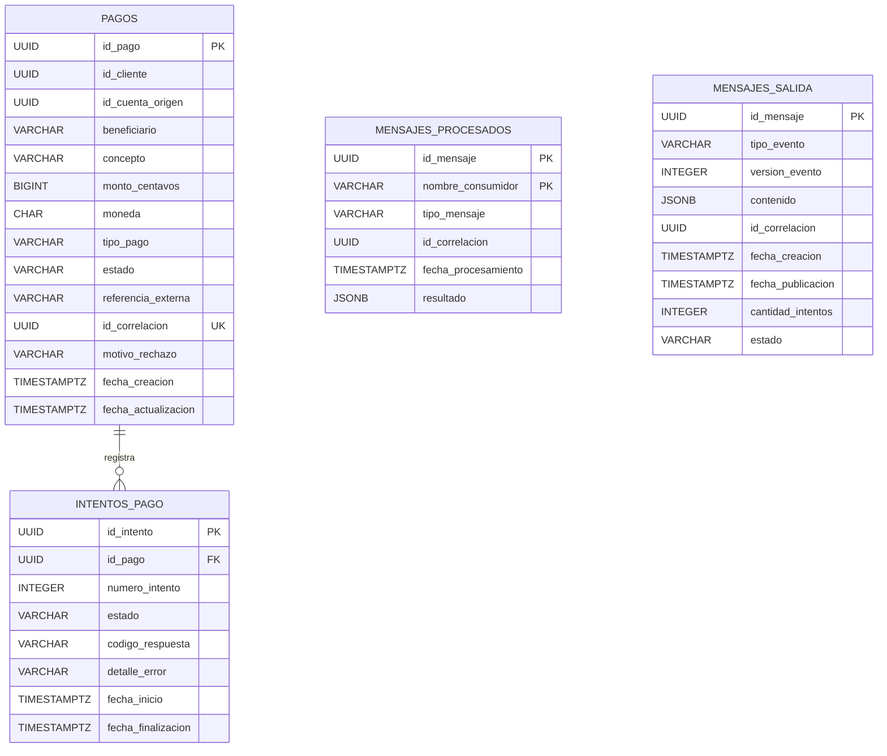

# Diagrama entidad-relación — Payment Service

```mermaid
erDiagram
    PAGOS {
        UUID id_pago PK
        UUID id_cliente
        UUID id_cuenta_origen
        VARCHAR beneficiario
        VARCHAR concepto
        BIGINT monto_centavos
        CHAR moneda
        VARCHAR tipo_pago
        VARCHAR estado
        VARCHAR referencia_externa
        UUID id_correlacion UK
        VARCHAR motivo_rechazo
        TIMESTAMPTZ fecha_creacion
        TIMESTAMPTZ fecha_actualizacion
    }

    INTENTOS_PAGO {
        UUID id_intento PK
        UUID id_pago FK
        INTEGER numero_intento
        VARCHAR estado
        VARCHAR codigo_respuesta
        VARCHAR detalle_error
        TIMESTAMPTZ fecha_inicio
        TIMESTAMPTZ fecha_finalizacion
    }

    MENSAJES_PROCESADOS {
        UUID id_mensaje PK
        VARCHAR nombre_consumidor PK
        VARCHAR tipo_mensaje
        UUID id_correlacion
        TIMESTAMPTZ fecha_procesamiento
        JSONB resultado
    }

    MENSAJES_SALIDA {
        UUID id_mensaje PK
        VARCHAR tipo_evento
        INTEGER version_evento
        JSONB contenido
        UUID id_correlacion
        TIMESTAMPTZ fecha_creacion
        TIMESTAMPTZ fecha_publicacion
        INTEGER cantidad_intentos
        VARCHAR estado
    }

    PAGOS ||--o{ INTENTOS_PAGO : registra
```

> `id_cliente` e `id_cuenta_origen` son referencias lógicas a otros microservicios, no claves foráneas físicas.

