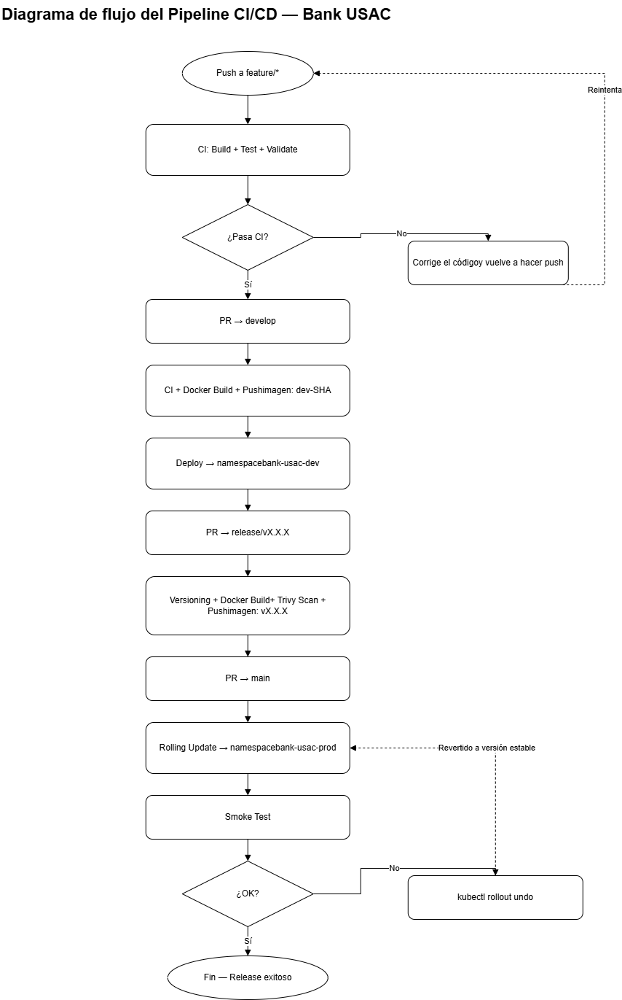

# Manual técnico de Bank USAC


## 1. Alcance y evolución del sistema

Bank USAC es una plataforma bancaria construida sobre una arquitectura de microservicios distribuida, reactiva y desacoplada, desarrollada con Go (Fiber), RabbitMQ como message broker para comunicación asíncrona mediante eventos (patrón Event-Driven / Saga coreografiada), React (Vite) para la interfaz web de usuario y PostgreSQL como sistema de persistencia relacional con el principio de *Database-per-Service* (una base de datos aislada por microservicio).

En la **Fase 2**, el sistema evoluciona desde un entorno local de prueba (Minikube / Docker Compose) hacia un entorno productivo y reproducible en la nube pública (**Google Cloud Platform — GCP**), incorporando:

1. **Extensión funcional de los microservicios:**
   - **Customer Service:** gestión del estado KYC (*Know Your Customer*: `PENDING`, `VERIFIED`, `REJECTED`) con validación obligatoria antes de operar.
   - **Account Service:** soporte para tipos de cuenta (`AHORRO` con regla de saldo mínimo, `CORRIENTE` con comisión por transacción).
   - **Transaction Service:** historial completo y trazabilidad de transferencias con filtros por cuenta, fecha y estados intermedios (`PENDING`, `APPROVED`, `FAILED`).
   - **Payment Service:** simulación de pasarelas de pago externas con escenarios controlados (`EXITO`, `FALLO`, `TIMEOUT`).
   - **Notification & Audit Service:** clasificación de eventos por severidad (`INFO`, `WARNING`, `ERROR`) y persistencia de auditoría estructurada.
   - **Transversal:** idempotencia obligatoria, trazabilidad de extremo a extremo mediante `correlationId`, transiciones formales de estado y manejo estructurado de errores.

2. **Infraestructura como Código (IaC) con Terraform:**
   - Provisionamiento automatizado, declarativo y versionado en GCP de la red VPC, subredes, clúster administrado Google Kubernetes Engine (GKE) con Node Pools autoescalables y cinco instancias independientes de **Cloud SQL (PostgreSQL 16)** administradas.

3. **Orquestación en Kubernetes (GKE):**
   - Despliegue de microservicios y RabbitMQ en dos namespaces aislados (`dev` y `prod`).
   - Autoescalado horizontal de Pods (**HPA**) con umbral de escalado al 80 % de uso de CPU para microservicios de alta demanda transaccional (`transaction-service` y `payment-service`).
   - Estrategia de despliegue `RollingUpdate` con cero tiempo de inactividad (`maxUnavailable: 0`, `maxSurge: 1`).

4. **Pipeline CI/CD automatizado:**
   - Integración Continua (CI) y Despliegue Continuo (CD) estructurado en ramas `feature/*`, `develop`, `release/*` y `main`.
   - Compilación, ejecución de pruebas unitarias, escaneo de vulnerabilidades, construcción y versionamiento semántico de imágenes de contenedor publicadas en Docker Hub / Artifact Registry, y despliegue automatizado hacia Kubernetes sin intervención manual.

5. **Frontend en la nube (Cloud Run):**
   - Despliegue del contenedor de interfaz web en Google Cloud Run (servicio serverless de rápida entrega sobre HTTPS) para cumplir con las directrices de entrega de Fase 2.

6. **Prácticas SRE (Site Reliability Engineering):**
   - Definición formal de indicadores (SLI), objetivos (SLO) y acuerdos (SLA) de nivel de servicio para cada componente, con cálculo de presupuesto de error (*Error Budget*) y protocolos de respuesta ante incidentes.

---

## 2. Estructura del repositorio

```text
├── gateway/
│   └── api-gateway/                      # API Gateway (Go + Fiber)
├── services/
│   ├── service-customer/                 # Customer Service (Go + Fiber + KYC)
│   ├── account-service/                  # Account Service (Go + Fiber + tipos de cuenta)
│   ├── transaction-service/              # Transaction Service (Go + Fiber + Saga + Historial)
│   ├── payment-service/                  # Payment Service (Go + Fiber + Simulador de pagos)
│   └── service-notification-audit/       # Notification & Audit Service (Go + Clasificador severidad)
├── frontend/
│   └── bank-usac-web/                    # Frontend React + Vite + Nginx
├── infrastructure/
│   ├── terraform/                        # Infraestructura como Código (GCP)
│   │   ├── versions.tf                   # Versiones de Terraform y providers (google >= 5.0)
│   │   ├── provider.tf                   # Configuración del provider de GCP
│   │   ├── variables.tf                  # Variables parametrizables de infraestructura
│   │   ├── terraform.tfvars.example      # Plantilla de valores de variables
│   │   ├── network.tf                    # VPC, subredes y reglas de firewall
│   │   ├── gke.tf                        # Clúster GKE, Node Pool y autoscaling
│   │   ├── cloud-sql.tf                  # 5 instancias Cloud SQL PostgreSQL 16
│   │   └── outputs.tf                    # Outputs y cadenas de conexión sensibles
│   └── kubernetes/                       # Manifiestos de Kubernetes (Kustomize)
│       ├── base/                         # Manifiestos comunes (Deployments, Services, ConfigMaps)
│       ├── overlays/
│       │   ├── dev/                      # Namespace bank-usac-dev, 1 réplica, imágenes dev-SHA
│       │   └── prod/                     # Namespace bank-usac-prod, réplicas productivas + HPA
│       ├── hpa/                          # HorizontalPodAutoscaler (target CPU 80%)
│       ├── deploy.sh                     # Script de despliegue local (Minikube)
│       └── deploy-gke.sh                 # Script de despliegue en Google Cloud GKE
├── .github/
│   └── workflows/                        # Pipelines de CI/CD (GitHub Actions)
│       ├── ci-feature.yml                # CI: Build + Test + Lint en feature/*
│       ├── cd-dev.yml                    # CI + Docker Build + Deploy dev en merge a develop
│       ├── release.yml                   # Versionado semántico + Push Docker Hub en release/*
│       └── cd-prod.yml                   # CD: Rolling Update prod + Smoke Tests en merge a main
├── Documentacion/                        # Documentación técnica, arquitectónica y SRE
│   ├── arquitectura/                     # Diagramas C4 (Contexto, Contenedores, Componentes)
│   ├── despliegue/                       # Diagrama y especificación de despliegue
│   ├── sre/                              # sre-sla-slo-sli.md (SLI, SLO, SLA y Error Budgets)
│   ├── eventos/                          # Catálogo y contratos de eventos AMQP
│   └── manuales/                         # manual-tecnico.md y manual-usuario.md
├── docker-compose.yml                    # Entorno local auxiliar para RabbitMQ y PostgreSQL
└── README.md                             # Documentación de inicio rápido
```

---

## 3. Arquitectura y extensiones funcionales (Fase 2)

### 3.1. Customer Service — Gestión de estado KYC

Customer Service incorpora el ciclo de vida del estado de validación del cliente (*Know Your Customer*):
- **Estados posibles:**
  - `PENDING`: Estado inicial tras el registro. El cliente no puede originar transferencias ni pagos.
  - `VERIFIED`: Validación formal completada exitosamente. El cliente está plenamente facultado para operar.
  - `REJECTED`: Validación rechazada por inconsistencias o incumplimiento de requisitos.
- **Validación transversal en la Saga:**
  Antes de procesar cualquier débito para transferencia o pago, el orquestador solicita la validación de estado KYC mediante el evento `cliente.kyc.validacion.solicitada`. El servicio responde con `cliente.kyc.verificado` o `cliente.kyc.rechazado`. Si el cliente no está en estado `VERIFIED`, la operación se aborta de inmediato sin generar cargos en cuenta.

### 3.2. Account Service — Tipos de cuenta y reglas de negocio

Account Service soporta ahora múltiples clasificaciones de cuenta con reglas financieras diferenciadas:
- **Cuenta de Ahorro (`AHORRO`):**
  - Implementa un umbral de **saldo mínimo obligatorio**.
  - Si un débito dejara el saldo por debajo del mínimo parametrizado, la operación es rechazada con el evento `cuenta.debito.rechazado` indicando `SALDO_MINIMO_NO_PERMITIDO`.
- **Cuenta Corriente (`CORRIENTE`):**
  - Admite transacciones comerciales y aplica una **comisión por transacción** opcional debilidada automáticamente durante la operación.
- **Validación previa:**
  Al recibir `cuenta.transferencia.validacion.solicitada`, el servicio valida titularidad, estado de la cuenta (activa), tipo de cuenta y suficiencia de fondos antes de autorizar el débito en la Saga.

### 3.3. Transaction Service — Historial y trazabilidad

Transaction Service mantiene el control del flujo de transferencias y la orquestación de la Saga coreografiada, extendiéndose con:
- **Trazabilidad por estados:**
  Cada transferencia transita de forma estricta por los estados: `PENDING` → `VALIDANDO_KYC` → `VALIDANDO_CUENTAS` → `DEBITANDO` → `ACREDITANDO` → `APPROVED` (o `FAILED` / `COMPENSADA` en caso de error).
- **Historial completo de auditoría:**
  Persistencia en tabla dedicada de historial que permite consultas filtradas por:
  - Número o identificador de cuenta (origen o destino).
  - Rango de fechas.
  - Estado terminal o intermedio de la transacción.

### 3.4. Payment Service — Simulación de proveedor externo de pagos

Para cumplir con la simulación de pasarelas de pago de terceros sin dependencias externas inestables, el servicio procesa comandos `pago.procesamiento.solicitado` aceptando un campo explícito `resultadoSimulado`:
- `EXITO`: Simula confirmación de la pasarela bancaria. El pago queda completado y se emite `pago.completado`.
- `FALLO`: Simula rechazo por parte de la red adquirente. Emite `pago.rechazado` con causa `PROVEEDOR_EXTERNO` y activa la compensación del débito previamente retenido.
- `TIMEOUT`: Simula falta de respuesta o tiempo de espera agotado. Emite `pago.rechazado` con causa `TIMEOUT_PROVEEDOR` y activa la compensación automática para reembolsar al cliente.

El detalle del intento, código de respuesta HTTP simulado y mensaje de error se persisten en la tabla `intentos_pago` garantizando trazabilidad técnica.

### 3.5. Notification & Audit Service — Notificaciones inteligentes y severidad

El servicio se suscribe a todos los intercambios de eventos del sistema mediante RabbitMQ, clasificando cada suceso en tres niveles de severidad:
- `INFO`: Operaciones regulares exitosas (registros, aperturas de cuenta, transferencias aprobadas, envíos de correo de activación).
- `WARNING`: Eventos de negocio anómalos o bloqueos no fatales (cliente rechazado por KYC, transferencias canceladas por saldo insuficiente, reintentos).
- `ERROR`: Fallos críticos del sistema, excepciones técnicas, timeouts de pasarela o activaciones de compensación en la Saga.

Los eventos se persisten de forma estructurada en la tabla `audit_events` asociando timestamp, microservicio de origen, `correlationId`, nivel de severidad y payload del evento.

### 3.6. Principios transversales obligatorios

- **Idempotencia:** Cada microservicio dispone de una tabla `mensajes_procesados` donde registra la clave de idempotencia o el `message_id` antes de comprometer cambios de negocio, descartando entregas duplicadas provocadas por reintentos de RabbitMQ.
- **CorrelationId:** Cada flujo iniciado en el API Gateway genera un UUID `correlationId` que se propaga en los headers AMQP de todos los mensajes derivados y se incluye en los logs y registros de auditoría.
- **Patrón Outbox:** Para garantizar consistencia transaccional entre la base de datos relacional y el broker de mensajería, el evento se guarda en la misma transacción SQL que los datos de negocio; un worker en segundo plano publica los eventos pendientes a RabbitMQ tras la confirmación del commit.

---

## 4. Infraestructura como Código (Terraform)

La infraestructura en GCP se define en el directorio `infrastructure/terraform/` y es 100 % reproducible.

### 4.1. Recursos provisionados

| Componente | Archivo Terraform | Recurso de GCP | Detalle técnico |
|---|---|---|---|
| Red virtual | `network.tf` | `google_compute_network` | VPC en modo personalizado (`bank-usac-vpc`) |
| Subred de datos | `network.tf` | `google_compute_subnetwork` | Rango `10.10.0.0/20` en región `us-central1` |
| Clúster GKE | `gke.tf` | `google_container_cluster` | GKE VPC-Native, release channel `REGULAR`, sin pool default |
| Node Pool GKE | `gke.tf` | `google_container_node_pool` | Nodos `e2-standard-2` con autoscaling (1 a 3 nodos por zona) |
| Customer DB | `cloud-sql.tf` | `google_sql_database_instance` | Cloud SQL PostgreSQL 16 (`bank-usac-customer-db`) |
| Account DB | `cloud-sql.tf` | `google_sql_database_instance` | Cloud SQL PostgreSQL 16 (`bank-usac-account-db`) |
| Transaction DB | `cloud-sql.tf` | `google_sql_database_instance` | Cloud SQL PostgreSQL 16 (`bank-usac-transaction-db`) |
| Payment DB | `cloud-sql.tf` | `google_sql_database_instance` | Cloud SQL PostgreSQL 16 (`bank-usac-payment-db`) |
| Notification DB | `cloud-sql.tf` | `google_sql_database_instance` | Cloud SQL PostgreSQL 16 (`bank-usac-notification-audit-db`) |
| Cuentas de usuario | `cloud-sql.tf` | `google_sql_user` | Usuarios específicos por base con contraseñas seguras aleatorias |

### 4.2. Comandos de aprovisionamiento

```bash
# 1. Autenticación en GCP y selección de proyecto
gcloud auth application-default login
gcloud config set project <ID_PROYECTO_GCP>

# 2. Inicialización de providers y backend de Terraform
cd infrastructure/terraform
terraform init

# 3. Validación sintáctica y de formato
terraform fmt -check
terraform validate

# 4. Planificación de cambios
terraform plan -out=tfplan

# 5. Aplicación controlada de infraestructura
terraform apply tfplan

# 6. Extracción de URLs de conexión seguras para Kubernetes Secrets
terraform output -json database_urls
```

> **Aislamiento de bases:** Ningún microservicio comparte base de datos con otro. Las instancias de Cloud SQL están aisladas por usuario y base (`customer_db`, `cuentas_db`, `transacciones_db`, `pagos_db`, `auditoria_db`).

---

## 5. Orquestación con Kubernetes (GKE)

### 5.1. Separación de entornos por namespaces

- `bank-usac-dev`: Namespace destinado a pruebas continuas e integración. Despliega los microservicios con 1 réplica por pod y recibe imágenes etiquetadas con el commit SHA (`:dev-<SHA>`).
- `bank-usac-prod`: Namespace productivo de alta disponibilidad. Despliega réplicas redundantes (mínimo 2 réplicas por servicio) y se nutre de imágenes etiquetadas con versiones semánticas aprobadas (`:vX.X.X`).

### 5.2. Autoescalado horizontal de Pods (HPA)

En cumplimiento de los requerimientos de la Fase 2, se implementa el recurso `HorizontalPodAutoscaler` (`autoscaling/v2`) para los servicios críticos sometidos a picos transaccionales:

```yaml
apiVersion: autoscaling/v2
kind: HorizontalPodAutoscaler
metadata:
  name: transaction-service-hpa
  namespace: bank-usac-prod
spec:
  scaleTargetRef:
    apiVersion: apps/v1
    kind: Deployment
    name: transaction-service
  minReplicas: 2
  maxReplicas: 6
  metrics:
  - type: Resource
    resource:
      name: cpu
      target:
        type: Utilization
        averageUtilization: 80
```

- **Métrica objetivo:** Cuando el consumo de CPU promedio supera el **80 %**, Kubernetes escala horizontalmente el Deployment añadiendo réplicas hasta el máximo configurado.
- **Servicios con HPA activo:** `transaction-service` y `payment-service`.

### 5.3. Estrategia de despliegue continuo (RollingUpdate)

Todos los Deployments configuran la política de actualización progresiva:
```yaml
strategy:
  type: RollingUpdate
  rollingUpdate:
    maxUnavailable: 0
    maxSurge: 1
```
Esto asegura que Kubernetes levante un Pod nuevo con la versión actualizada y verifique sus sondas de `readinessProbe` antes de dar de baja el Pod antiguo, garantizando cero caídas de servicio.

---

## 6. Pipeline de CI/CD (GitHub Actions)

El ciclo de vida del software está 100 % automatizado sin despliegues manuales en producción.

### 6.1. Flujo de ramas y pipeline


### 6.2. Fases obligatorias del pipeline

1. **Fase CI en `feature/*`:** Compilación del código Go y frontend React, ejecución de pruebas unitarias (`go test -v ./...`), validación de sintaxis y convenciones. Si una prueba falla, el pipeline aborta de inmediato.
2. **Fase Dev en `develop`:** Tras la aprobación del Pull Request, se construyen las imágenes de contenedor etiquetadas con `:dev-<GITHUB_SHA>`, se publican en Docker Hub y se actualizan los Deployments en el namespace `bank-usac-dev`.
3. **Fase Release en `release/v*`:** Se ejecuta el análisis estático de seguridad con **Trivy**, se genera el tag de versión semántica formal (ej. `v2.1.0`) y se construyen las imágenes definitivas publicadas en el registro. **Está terminantemente prohibido el uso de la etiqueta `latest`.**
4. **Fase CD en `main`:** Al fusionar en `main`, el pipeline aplica los manifiestos al namespace `bank-usac-prod` ejecutando un `kubectl rollout status`. Al finalizar se disparan **Smoke Tests** sobre los endpoints de salud. Si los Smoke Tests fallan, se ejecuta automáticamente un `kubectl rollout undo` para revertir al estado estable anterior.

---

## 7. Despliegue del Frontend (Google Cloud Run)

En conformidad con las especificaciones de entrega de la Fase 2 (que prohíben alojamiento estático en S3 y requieren ejecución en un servicio de despliegue rápido o servidor administrado):

- El frontend React se empaqueta dentro de una imagen de contenedor optimizada basada en `nginx:alpine`, la cual sirve los artefactos estáticos compilados y reenvía las peticiones de API hacia el API Gateway.
- La imagen se despliega en **Google Cloud Run** como servicio completamente administrado y serverless, contando con:
  - Certificado SSL/TLS administrado de forma nativa sobre HTTPS.
  - Escalado automático a cero cuando no hay demanda y escalado horizontal ante picos de tráfico.
  - Conexión segura hacia los servicios del clúster GKE mediante Serverless VPC Access o el punto de entrada seguro del Gateway.

Comando de despliegue automatizado por el pipeline:
```bash
gcloud run deploy bank-usac-frontend   --image docker.io/<ORGANIZACION>/bank-usac-frontend:vX.X.X   --platform managed   --region us-central1   --allow-unauthenticated   --port 80
```

---

## 8. Ingeniería de Confiabilidad del Sitio (SRE)

Para asegurar la observabilidad y calidad del sistema en producción, se establecen los marcos de SRE documentados formalmente en `sre-sla-slo-sli.md`:

### 8.1. Métricas e indicadores (SLI / SLO)

| Servicio | SLI (Qué se mide) | SLO (Objetivo interno) | SLA Propuesto (Compromiso) |
|---|---|---|---|
| **Frontend (Cloud Run)** | Ratio de solicitudes HTTPS exitosas (HTTP 2xx/3xx) | ≥ 99.5 % mensual; Latencia p95 ≤ 2.0 s | ≥ 99.0 % mensual |
| **Customer Service** | Ratio de validaciones KYC procesadas exitosamente | ≥ 99.5 % mensual; Resolución ≤ 5.0 s (p95) | ≥ 99.0 % mensual |
| **Account Service** | Operaciones de débito/crédito y validación de reglas | ≥ 99.5 % mensual; Tiempo de proceso ≤ 5.0 s (p95) | ≥ 99.0 % mensual |
| **Transaction Service** | Transferencias que alcanzan estado terminal (`APPROVED`/`FAILED`) | ≥ 99.5 % mensual; Tiempo Saga ≤ 30.0 s | ≥ 99.0 % mensual |
| **Payment Service** | Respuestas consistentes y resolución de timeout simulado | ≥ 99.5 % mensual; Tiempo de respuesta ≤ 30.0 s | ≥ 99.0 % mensual |
| **Notification & Audit** | Eventos capturados, clasificados y persistidos en base | ≥ 99.5 % mensual; Persistencia ≤ 10.0 s (p95) | ≥ 99.0 % mensual |

### 8.2. Error Budget y protocolo de rollback

Para un SLO del 99.5 % mensual (en un mes de 30 días = 43,200 minutos), el presupuesto de error (*Error Budget*) admisible es de:
$$43200	ext{ min} 	imes 0.005 = 216	ext{ minutos de degradación/indisponibilidad}$$

- **Política de consumo del presupuesto:** Si incidentes recurrentes agotan más del 50 % del presupuesto de error en los primeros 10 días, se congelan los despliegues de nuevas funcionalidades en `main` y el equipo se enfoca exclusivamente en estabilidad, refactorización de confiabilidad y cobertura de pruebas.
- **Rollback automatizado:** Ante cualquier alerta crítica disparada durante el despliegue o falla de los Smoke Tests en CD, se dispara la reversión inmediata:
  ```bash
  kubectl -n bank-usac-prod rollout undo deployment/<service-name>
  ```

---

## 9. Catálogo de API y contratos de endpoints

Todas las solicitudes pasan por el API Gateway y requieren el header `Authorization: Bearer <JWT>` (a excepción de login y activación).

| Método | Endpoint | Roles admitidos | Descripción / Función Fase 2 |
|---|---|---|---|
| POST | `/api/clientes/login` | Público | Autenticación y emisión de JWT |
| POST | `/api/clientes/registro` | TELLER, ADMIN | Registro de nuevo cliente (estado inicial `PENDING`) |
| GET | `/api/clientes/activacion` | Público | Verificación de token recibido por correo SMTP |
| PATCH | `/api/clientes/:id/kyc` | ADMIN | **(Nuevo Fase 2)** Actualizar estado KYC (`VERIFIED` / `REJECTED`) |
| GET | `/api/cuentas` | CLIENTE | Listar cuentas del usuario autenticado |
| POST | `/api/cuentas` | TELLER | **(Nuevo Fase 2)** Crear cuenta especificando tipo (`AHORRO` o `CORRIENTE`) |
| POST | `/api/cuentas/:id/deposito` | TELLER | Depósito de fondos de prueba (emite `cuenta.credito.solicitado`) |
| GET | `/api/cuentas/:id/movimientos` | CLIENTE, ADMIN | Consultar historial de débitos y créditos con desglose de comisión |
| POST | `/api/transferencias` | CLIENTE | Iniciar transferencia asíncrona orquestada mediante Saga |
| GET | `/api/transferencias/historial` | CLIENTE, ADMIN | **(Nuevo Fase 2)** Consultar historial de transferencias con filtros |
| POST | `/api/pagos` | CLIENTE | **(Nuevo Fase 2)** Procesar pago simulando `resultadoSimulado` |
| GET | `/api/auditoria/eventos` | ADMIN | **(Nuevo Fase 2)** Consultar bitácora clasificada (`INFO`, `WARNING`, `ERROR`) |

---

## 10. Procedimiento de verificación y diagnóstico

### 10.1. Verificación técnica de salud del sistema

```bash
# 1. Comprobar pods activos en ambos namespaces
kubectl get pods -n bank-usac-dev
kubectl get pods -n bank-usac-prod -o wide

# 2. Verificar estado de los HPA en producción
kubectl get hpa -n bank-usac-prod

# 3. Comprobar estado de las colas e intercambios en RabbitMQ
kubectl -n bank-usac-prod exec -it rabbitmq-0 -- rabbitmqctl list_queues name messages_ready messages_unacknowledged

# 4. Verificar conectividad a Cloud SQL desde un pod
kubectl -n bank-usac-prod exec -it deploy/transaction-service -- nc -zv <IP_PRIVADA_CLOUD_SQL> 5432
```

### 10.2. Diagnóstico de incidentes comunes

- **El Pod se queda en `CrashLoopBackOff`:** Inspeccionar logs con `kubectl logs -n bank-usac-prod deploy/<nombre-servicio>`. Generalmente indica falta de una variable en el Secret o que la instancia de Cloud SQL aún no acepta conexiones en el puerto 5432.
- **Mensajes acumulados en RabbitMQ sin consumir:** Verificar que las credenciales AMQP en el ConfigMap/Secret coincidan con las del StatefulSet de RabbitMQ y comprobar la existencia de la cola `DLQ` (*Dead Letter Queue*).
- **El HPA no escala los Pods:** Verificar que el clúster tenga instalado y operativo el `metrics-server` (`kubectl top pods -n bank-usac-prod`). Si los Pods no definen `resources.requests.cpu`, el HPA no podrá calcular el porcentaje de utilización.
- **Rollout fallido en GitHub Actions:** Revisar la salida del paso *Smoke Tests* en el Action. Para forzar una reversión manual en caso de emergencia:
  ```bash
  kubectl rollout undo deployment/payment-service -n bank-usac-prod
  ```

---

## 11. Comparativa arquitectónica entre Fase 1 y Fase 2

| Parámetro | Fase 1 | Fase 2 |
|---|---|---|
| **Entorno de ejecución** | Minikube (local en una máquina) | Google Cloud Platform (GKE + Cloud Run) |
| **Aprovisionamiento** | Manual o mediante scripts Docker Compose | Infraestructura como Código (IaC) reproducible con **Terraform** |
| **Bases de datos** | Contenedores en host local | 5 instancias aisladas de **Cloud SQL (PostgreSQL 16)** |
| **Pipeline de integración** | Sin automatización completa | **CI/CD con GitHub Actions** en 4 ramas (`feature`, `develop`, `release`, `main`) |
| **Versionamiento de imágenes** | `latest` o local | Versionado semántico (`vX.X.X`) escaneado con **Trivy** en Docker Hub |
| **Autoescalado** | Ninguno (estático) | **HPA** configurado al 80 % de CPU en servicios críticos |
| **Frontend** | Contenedor local en Minikube | Servicio serverless en **Google Cloud Run** sobre HTTPS |
| **SRE y Confiabilidad** | Sin métricas formales | Definición y monitorización formal de **SLI, SLO, SLA y Error Budget** |
| **Lógica de negocio** | Transferencias simples | KYC (`VERIFIED`), tipos de cuenta (`AHORRO`/`CORRIENTE`), simulación de pagos externos y auditoría con severidad |
