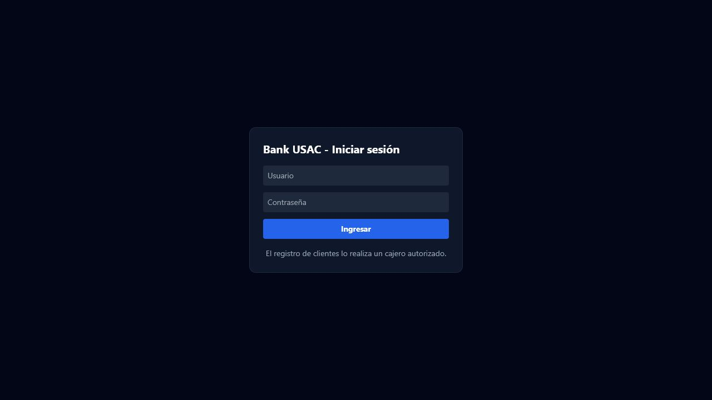
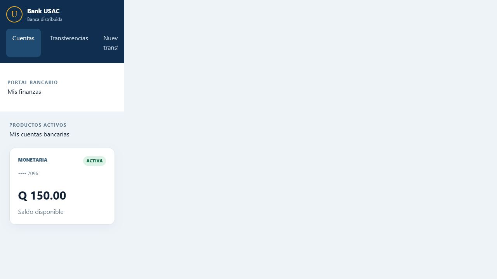
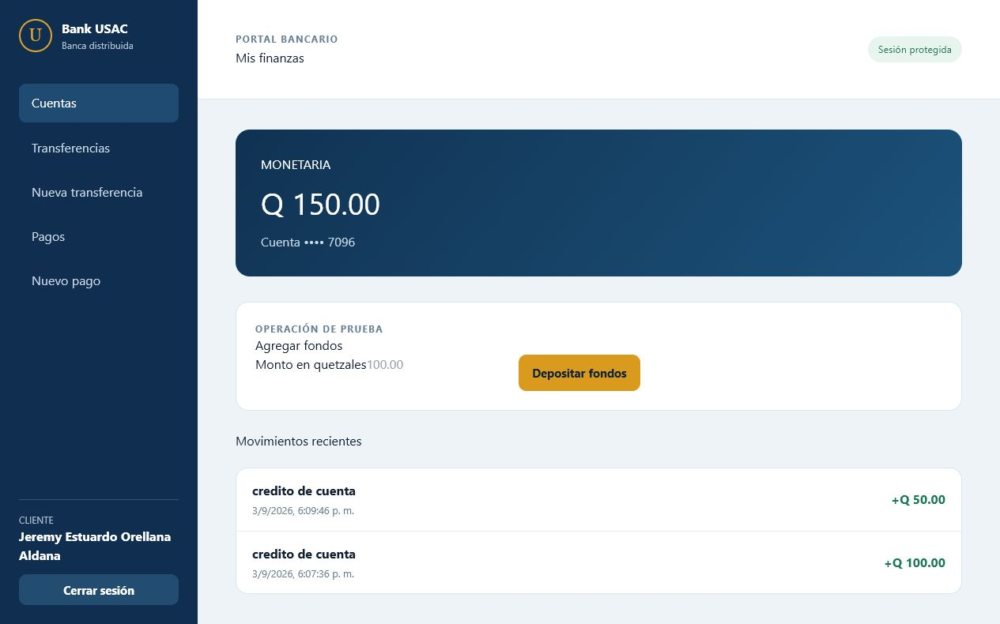
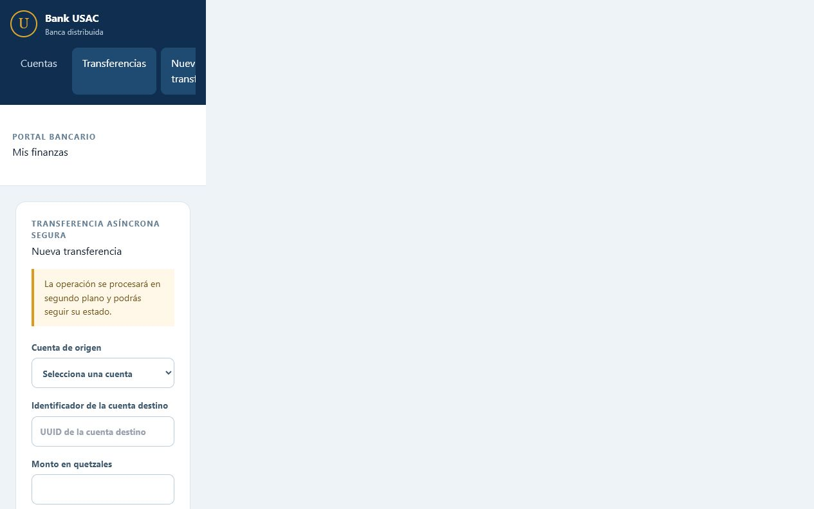
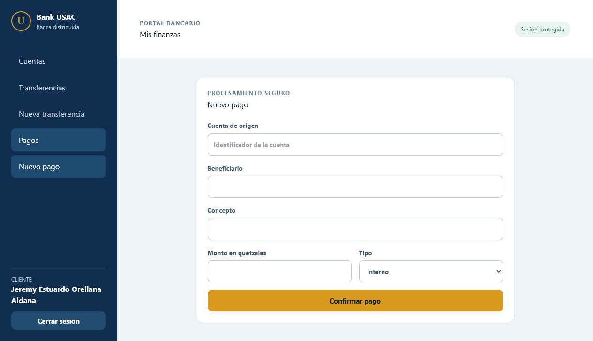
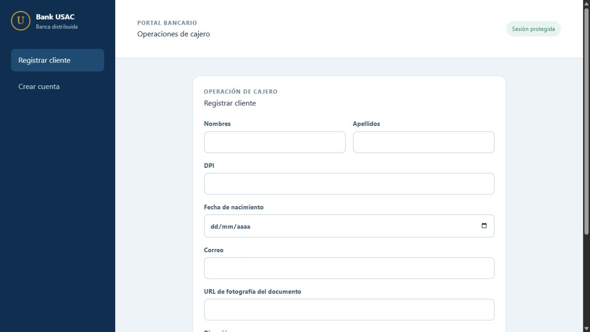

# Manual de usuario — Bank USAC

Este manual explica cómo utilizar el portal bancario Bank USAC según el rol del usuario. Las pantallas incluidas fueron capturadas desde el frontend ejecutándose en el entorno local del proyecto.

## 1. Acceso al sistema

1. Verifique que el frontend, el API Gateway, los microservicios, RabbitMQ y las bases de datos estén iniciados. El procedimiento técnico se encuentra en [Manual técnico](manual-tecnico.md).
2. Abra un navegador y visite `http://localhost:3000`.
3. Ingrese las credenciales entregadas por el banco y seleccione **Iniciar sesión**.

La sesión utiliza un token JWT. El token se guarda únicamente en el navegador y se envía automáticamente en las operaciones que requieren autenticación. Cierre sesión desde el menú del usuario cuando termine.

## 2. Roles y permisos

| Rol | Operaciones principales |
|---|---|
| **Cliente** | Consultar sus cuentas y saldos, agregar fondos a una cuenta propia, realizar transferencias y registrar pagos. |
| **Cajero receptor (TELLER)** | Registrar clientes, consultar clientes y crear cuentas bancarias para clientes. |
| **Administrador (ADMIN)** | Consultar usuarios, revisar información de auditoría y administrar las operaciones permitidas por el sistema. |

El sistema impide abrir pantallas o ejecutar operaciones que no correspondan al rol autenticado.

## 3. Flujo del cliente

### 3.1 Consultar cuentas y saldo

Después de iniciar sesión, la pantalla **Mis cuentas bancarias** muestra las cuentas asociadas al cliente, su tipo, estado y saldo disponible.

Seleccione una cuenta para ver sus datos y el historial de movimientos.

### 3.2 Agregar fondos

1. En el detalle de la cuenta, ubique **Agregar fondos**.
2. Escriba un monto positivo en quetzales.
3. Presione **Depositar fondos**.
4. El sistema registra la solicitud y publica el evento correspondiente. Actualice la pantalla para consultar el saldo resultante.

No envíe varias veces el mismo formulario mientras la solicitud aparece como pendiente. Si el monto no es válido, la pantalla muestra el motivo y no se registra el depósito.

### 3.3 Realizar una transferencia

1. Abra **Transferencias** y seleccione **Nueva transferencia**.
2. Seleccione la cuenta de origen.
3. Escriba el identificador de la cuenta destino (UUID).
4. Indique el monto y, opcionalmente, una descripción.
5. Presione **Confirmar transferencia**.

Las transferencias se procesan de forma asíncrona mediante RabbitMQ. La respuesta inicial confirma que la solicitud fue recibida; el estado final puede consultarse desde el listado o detalle de operaciones. Una transferencia requiere una cuenta origen activa y saldo suficiente.

### 3.4 Registrar un pago

1. Abra **Pagos** y seleccione **Nuevo pago**.
2. Seleccione la cuenta desde la que se debitará el dinero.
3. Ingrese el beneficiario, el concepto y el monto.
4. Seleccione el tipo de pago: **Interno** o **Externo**.
5. Presione **Confirmar pago**.

El pago queda en estado de procesamiento mientras el servicio de pagos consume el evento. Consulte nuevamente la operación para confirmar si fue aprobada o rechazada.

### 3.5 Activar la cuenta por correo

Cuando un cajero registra un cliente, el servicio de notificaciones envía un correo con un enlace de activación. Para activar la cuenta:

1. Abra el enlace recibido antes de su fecha de vencimiento.
2. Espere la confirmación de activación.
3. Regrese a la pantalla de inicio de sesión e ingrese sus credenciales.

El enlace contiene un token de un solo uso; no lo comparta. Si está vencido, solicite al cajero que gestione un nuevo registro o reenvío según el procedimiento definido por el banco.

## 4. Flujo del cajero receptor

### 4.1 Registrar un cliente

1. Inicie sesión con un usuario TELLER.
2. Seleccione **Registrar cliente**.
3. Complete nombres, apellidos, DPI, fecha de nacimiento, correo, dirección y contraseña temporal.
4. Proporcione la URL de la fotografía del documento de identificación.
5. Presione **Registrar cliente**.

El sistema valida los datos, evita duplicados y genera un identificador y un nombre de usuario. El cliente queda pendiente de activación hasta confirmar el enlace enviado por correo.

### 4.2 Crear una cuenta bancaria

1. En el menú del cajero, seleccione **Crear cuenta**.
2. Seleccione el cliente previamente registrado.
3. Seleccione el tipo de cuenta (por ejemplo, monetaria o ahorro).
4. Ingrese el saldo inicial, si corresponde, y confirme.
5. Entregue al cliente el identificador de la cuenta para que pueda recibir transferencias.

La cuenta se crea en **Account Service**. El saldo y los movimientos posteriores se administran dentro de ese contexto; no se deben modificar directamente desde otra base de datos.

## 5. Flujo del administrador

1. Inicie sesión con un usuario ADMIN.
2. Utilice la sección de administración para consultar usuarios y el estado de sus cuentas.
3. Abra la sección de auditoría para revisar eventos de registro, activación, transferencias, pagos y cambios relevantes.
4. No modifique manualmente registros de las bases de datos; las acciones deben realizarse mediante las pantallas y endpoints autorizados.

## 6. Estados y notificaciones

Las operaciones de fondos, transferencias y pagos se comunican como eventos. Por ello, es normal que una operación aparezca inicialmente como **pendiente** o **procesando**. El flujo recomendado es:

1. Confirmar que la pantalla aceptó la solicitud.
2. Esperar unos segundos para que RabbitMQ entregue el evento.
3. Actualizar el listado o consultar el identificador de la operación.
4. Revisar el estado final y el mensaje mostrado.

El servicio externo de correo se utiliza para enlaces de activación y las notificaciones habilitadas por el proyecto. Las notificaciones de negocio pueden quedar registradas también en el historial de auditoría.

## 7. Problemas frecuentes

| Mensaje o situación | Qué hacer |
|---|---|
| **Credenciales inválidas** | Verifique usuario, contraseña y que la cuenta esté activa. |
| **No autorizado** | Cierre sesión e ingrese con un rol que tenga permiso para la operación. |
| **Cuenta inactiva** | Active el cliente desde el enlace recibido por correo. |
| **Saldo insuficiente** | Reduzca el monto o agregue fondos a la cuenta origen. |
| **UUID destino inválido** | Copie nuevamente el identificador completo de la cuenta destino. |
| **Operación pendiente** | Espere el consumo del evento y consulte el estado; no duplique la solicitud. |
| **No llegó el correo** | Revise spam, confirme el correo registrado y solicite un nuevo enlace al cajero. |
| **Servicio no disponible** | Confirme que los contenedores y pods estén activos; consulte el Manual técnico. |

## 8. Buenas prácticas

- No comparta contraseñas, tokens JWT ni enlaces de activación.
- Compruebe la cuenta origen y el monto antes de confirmar.
- Conserve el identificador de una operación cuando necesite reportarla.
- Cierre sesión al terminar y no utilice cuentas de prueba para operaciones reales.
