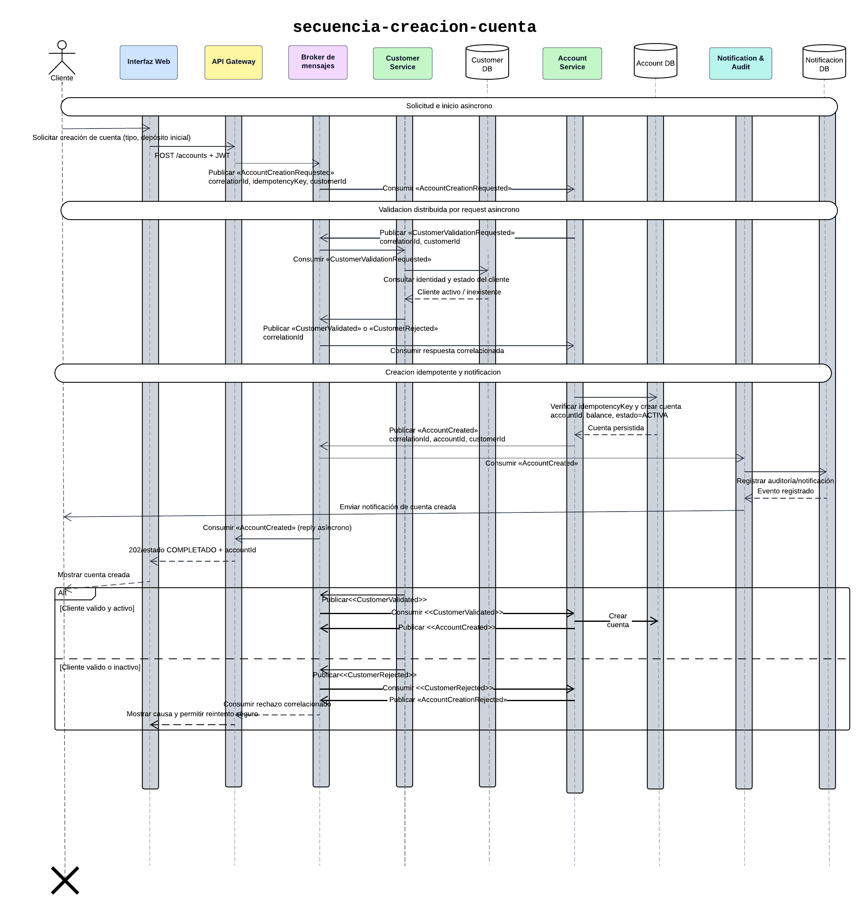

# Secuencia de creación de cuenta

Flujo asíncrono para crear una cuenta y validar al cliente mediante RabbitMQ.

El flujo comienza cuando el cliente solicita crear una cuenta monetaria o de ahorro desde la interfaz web. La interfaz envía la solicitud autenticada mediante JWT al API Gateway, que funciona únicamente como punto de entrada.
El Gateway publica el evento AccountCreationRequested en el broker. Account Service consume este evento y solicita, también mediante mensajería asíncrona, que Customer Service valide la identidad y el estado del cliente.
Customer Service consulta su propia base de datos y publica uno de los siguientes eventos:
- CustomerValidated, cuando el cliente existe y está activo.
- CustomerRejected, cuando el cliente no existe, está inactivo o sus datos no son válidos.
Si la validación es exitosa, Account Service verifica la idempotencyKey, genera el accountId y registra la nueva cuenta en su propia base de datos con el balance inicial y el estado correspondiente. Luego publica AccountCreated.
Notification & Audit Service consume este evento, registra la operación para auditoría y envía una notificación al cliente. El API Gateway también consume la respuesta correlacionada y comunica a la interfaz que la creación terminó correctamente.
Si la validación falla, Account Service publica AccountCreationRejected. El Gateway consume el rechazo y la interfaz muestra la causa del error, permitiendo realizar un nuevo intento de forma segura.