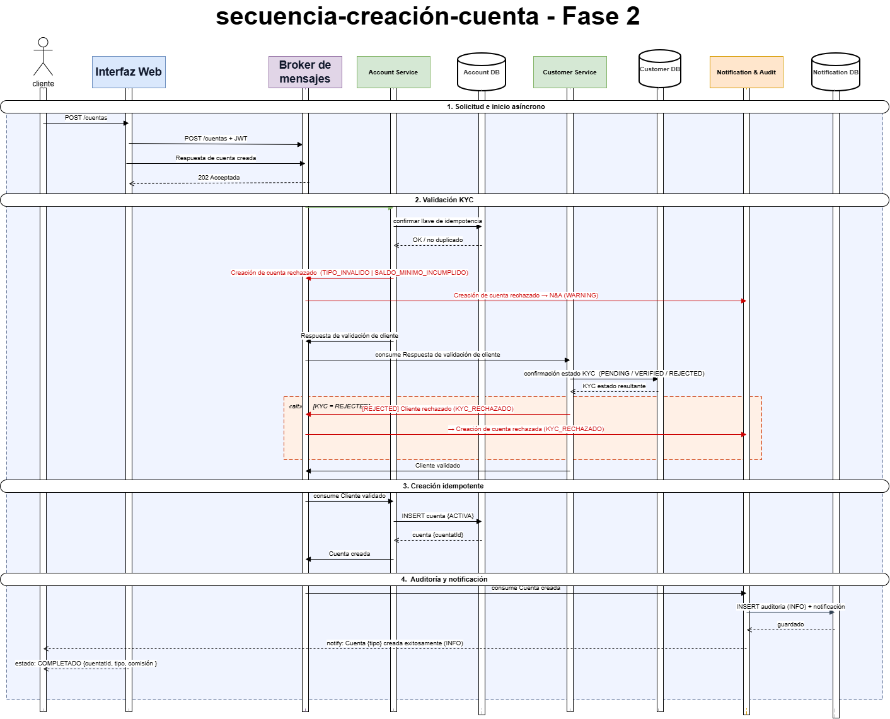

# Secuencia de creación de cuenta

Flujo asíncrono para crear una cuenta y validar al cliente mediante RabbitMQ.




## 1. Descripción general
Este diagrama describe el flujo asíncrono de creación de cuenta bancaria, incluyendo las validaciones del cliente (KYC), la lógica de idempotencia, la persistencia, la auditoría y las nuevas reglas de **Fase 2**: selección de tipo de cuenta (AHORRO / CORRIENTE), validación de saldo mínimo y aplicación de comisión según el tipo.

---

## 2. Participantes

| Actor / Sistema           | Rol                                                                                       |
|---------------------------|-------------------------------------------------------------------------------------------|
| **Cliente**               | Usuario final que solicita la apertura de una cuenta bancaria                             |
| **Frontend**              | Aplicación web/móvil que recoge la solicitud y la envía a la API                          |
| **API Gateway**           | Punto de entrada HTTP; valida JWT, aplica rate-limiting y enruta al servicio              |
| **Broker (RabbitMQ)**     | Bus de mensajes asíncrono; distribuye los eventos entre microservicios                    |
| **Account Service**       | Orquesta la creación: valida tipo, reglas de negocio y persiste la cuenta                 |
| **Account DB**            | Base de datos de cuentas (PostgreSQL en GKE)                                              |
| **Customer Service**      | Valida la identidad y el estado KYC del cliente                                           |
| **Customer DB**           | Base de datos de clientes y estado KYC                                                    |
| **Notification & Audit**  | Registra todos los eventos de auditoría y envía notificaciones al cliente                 |
| **Notification DB**       | Almacenamiento persistente de notificaciones y registros de auditoría                     |

---

## 3. Tipos de cuenta soportados   Fase 2

| Tipo       | Saldo mínimo | Comisión mensual |
|------------|-------------|-----------------|
| AHORRO     | Q 100.00    | Q 0.00          |
| CORRIENTE  | Q 500.00    | Q 25.00 / mes   |

  = Funcionalidad nueva incorporada en Fase 2.

---

## 4. Flujo principal

### 4.1 Solicitud e inicio asíncrono

1. El **Cliente** selecciona el tipo de cuenta (AHORRO o CORRIENTE)   y completa el formulario en el **Frontend**.
2. El **Frontend** envía `POST /accounts` al **API Gateway** con JWT de autenticación y el campo `accountType` en el body.
3. El **API Gateway** valida el token JWT y publica el evento `AccountCreationRequested` en el **Broker (RabbitMQ)**, incluyendo:
   - `customerId`
   - `accountType` (AHORRO | CORRIENTE)  
   - `idempotencyKey` (UUID generado por el Frontend)
4. El **API Gateway** devuelve `202 Accepted` al **Frontend** mientras el proceso continúa de forma asíncrona.

---

### 4.2 Validación de tipo de cuenta y reglas de negocio   Fase 2

5. El **Account Service** consume el evento `AccountCreationRequested` del **Broker**.
6. Verifica en **Account DB** si ya existe una cuenta con el mismo `idempotencyKey` (lógica de idempotencia).
   - Si ya existe → devuelve la cuenta existente (`AccountAlreadyExists`) sin crear duplicado.
7. Valida el `accountType` recibido:
   - Si el tipo no es AHORRO ni CORRIENTE → publica `AccountCreationRejected` (causa: `TIPO_INVALIDO`) y termina.
8. Valida que el saldo inicial proporcionado cumpla el saldo mínimo del tipo seleccionado  :
   - AHORRO: ≥ Q 100.00; CORRIENTE: ≥ Q 500.00.
   - Si no cumple → publica `AccountCreationRejected` (causa: `SALDO_MINIMO_INCUMPLIDO`) y termina.
9. Calcula la comisión mensual correspondiente al tipo  :
   - AHORRO: Q 0.00; CORRIENTE: Q 25.00/mes.

---

### 4.3 Validación del cliente (KYC)

10. El **Account Service** publica `CustomerValidationRequested` en el **Broker**, indicando el `customerId`.
11. El **Customer Service** consume el evento, consulta **Customer DB** y evalúa el estado KYC:
    - `PENDING` → en proceso de verificación; se espera hasta resolución.
    - `VERIFIED` → cliente validado → publica `CustomerValidated`.
    - `REJECTED` → cliente no apto → publica `CustomerRejected` (causa: `KYC_RECHAZADO`).
12. Si se recibe `CustomerRejected`, el **Account Service** publica `AccountCreationRejected` y el proceso termina.

---

### 4.4 Creación idempotente de la cuenta

13. El **Account Service** persiste la nueva cuenta en **Account DB** con los siguientes atributos:
    - `accountId` (UUID)
    - `customerId`
    - `accountType` (AHORRO | CORRIENTE)  
    - `balance` (saldo inicial)
    - `minimumBalance` (saldo mínimo según tipo)  
    - `monthlyFee` (comisión calculada)  
    - `status` = `ACTIVA`
    - `idempotencyKey`
    - `createdAt`
14. Publica el evento `AccountCreated` en el **Broker** con todos los datos de la cuenta.

---

### 4.5 Auditoría, notificación y respuesta

15. El **Notification & Audit** consume `AccountCreated` del **Broker**:
    - Registra el evento de auditoría en **Notification DB** (tipo: `INFO`).
    - Envía notificación al cliente: "Su cuenta {tipo} ha sido creada con éxito (ID: {accountId})".
16. El **Frontend** recibe la respuesta definitiva via WebSocket o polling:
    - Estado: `COMPLETADO`
    - `accountId` de la cuenta creada
    - Tipo de cuenta y comisión mensual  

---

## 5. Caminos alternativos

### 5.1 Cliente con KYC rechazado

- Evento: `CustomerRejected` → `AccountCreationRejected` (causa: `KYC_RECHAZADO`)
- **Notification & Audit** registra el evento (tipo: `WARNING`) y notifica al cliente: "No es posible crear la cuenta: identidad no verificada."
- Respuesta al Frontend: `RECHAZADO` con motivo `KYC_RECHAZADO`.

### 5.2 Tipo de cuenta inválido   Fase 2

- Evento: `AccountCreationRejected` (causa: `TIPO_INVALIDO`)
- **Notification & Audit** registra (tipo: `WARNING`).
- Respuesta al Frontend: `RECHAZADO` con motivo `TIPO_INVALIDO`.

### 5.3 Saldo inicial insuficiente   Fase 2

- Evento: `AccountCreationRejected` (causa: `SALDO_MINIMO_INCUMPLIDO`)
- **Notification & Audit** registra (tipo: `WARNING`).
- Respuesta al Frontend: `RECHAZADO` con motivo `SALDO_MINIMO_INCUMPLIDO` + saldo mínimo requerido.

### 5.4 Solicitud duplicada (idempotencia)

- El `idempotencyKey` ya existe en Account DB.
- El **Account Service** devuelve los datos de la cuenta existente sin crear duplicado.
- Respuesta al Frontend: datos de la cuenta ya creada con indicador `DUPLICADO`.

---

## 6. Estados de la cuenta

```
SOLICITADA → VALIDANDO_TIPO   → VALIDANDO_KYC → CREANDO → ACTIVA
                                               ↓
                                          RECHAZADA
```

---

## 7. Eventos publicados

| Evento                      | Publicado por        | Consumido por             | Clasificación |
|-----------------------------|----------------------|---------------------------|---------------|
| `AccountCreationRequested`  | API Gateway          | Account Service           | —             |
| `CustomerValidationRequested` | Account Service    | Customer Service          | —             |
| `CustomerValidated`         | Customer Service     | Account Service           | —             |
| `CustomerRejected`          | Customer Service     | Account Service           | WARNING       |
| `AccountCreated`            | Account Service      | Notification & Audit      | INFO          |
| `AccountCreationRejected`   | Account Service      | Notification & Audit      | WARNING       |

---

## 8. Notas de implementación

- **Idempotencia:** El `idempotencyKey` se indexa en Account DB para garantizar que solicitudes duplicadas no generen cuentas duplicadas.
- **KYC:** El estado KYC se almacena en Customer DB y puede ser PENDING, VERIFIED o REJECTED. Solo cuentas con KYC VERIFIED pueden ser creadas.
- **Comisión mensual  :** El `monthlyFee` se almacena en la cuenta y es cobrado por un proceso batch separado (fuera del alcance de este diagrama).
- **Saldo mínimo  :** El `minimumBalance` se valida en la creación y en cada operación posterior (transferencias, pagos).
- **Auditoría:** Todos los eventos (éxito y rechazo) quedan registrados en Notification DB para trazabilidad.

---