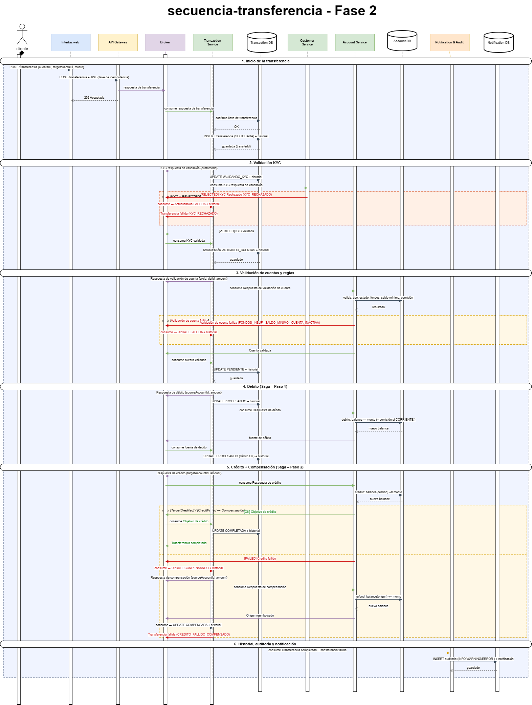

# Secuencia de transferencia bancaria

Flujo de transferencia, Saga, fallos y compensaciones.



## 1. Descripción general

Este diagrama describe el flujo de transferencia entre cuentas bancarias internas mediante el **patrón Saga Coreografiado**. El flujo garantiza consistencia eventual a través de pasos coordinados: validación KYC, validación de cuentas y reglas, débito, crédito e historial de transacciones. En caso de fallo en cualquier paso, se ejecuta la compensación correspondiente para revertir los cambios ya aplicados.

> **Fase 2:** El **Payment Service no interviene** en transferencias internas. El flujo ahora incluye explícitamente al **API Gateway** y al **Broker** como participantes, incorpora la validación de estado KYC, las reglas de tipo de cuenta, saldo mínimo y comisión, y registra el historial de transacciones con filtros por cuenta, fecha y estado.

---

## 2. Participantes

| Actor / Sistema           | Rol                                                                                                      |
|---------------------------|----------------------------------------------------------------------------------------------------------|
| **Cliente**               | Usuario final que solicita la transferencia                                                              |
| **Frontend**              | Aplicación web/móvil que recoge la solicitud                                                             |
| **API Gateway**           | Punto de entrada HTTP; valida JWT y publica el evento inicial en el Broker                              |
| **Broker (RabbitMQ)**     | Bus de mensajes; coordina los eventos de la Saga entre microservicios                                    |
| **Transaction Service**   | Crea y gestiona el registro de la transacción y su historial de estados                                  |
| **Transaction DB**        | Base de datos de transacciones e historial                                                               |
| **Customer Service**      | Valida el estado KYC del cliente remitente (PENDING / VERIFIED / REJECTED)                             |
| **Account Service**       | Valida tipo, estado y fondos de ambas cuentas; ejecuta débito, crédito y compensación                   |
| **Account DB**            | Base de datos de cuentas y saldos                                                                        |
| **Notification & Audit**  | Consume el resultado final; registra auditoría y envía notificación al cliente                           |
| **Notification DB**       | Almacenamiento de notificaciones y registros de auditoría                                                |

>  **Payment Service no aparece en este flujo.** Las transferencias internas son gestionadas íntegramente por Account Service.

---

## 3. Estados de la transacción

```
SOLICITADA
   → VALIDANDO_KYC         (esperando respuesta de Customer Service)
       → VALIDANDO_CUENTAS  (esperando respuesta de Account Service)
           → PENDIENTE       (cuentas y reglas validadas; listo para procesar)
               → PROCESANDO  (débito en curso)
                   → COMPLETADA   (débito + crédito aplicados)
                   → FALLIDA      (crédito falló; sin débito previo)
                   → COMPENSANDO  (débito aplicado pero crédito falló → revertir débito)
                       → COMPENSADA          (débito revertido con éxito)
                       → COMPENSACION_FALLIDA (error al revertir; requiere intervención manual)
```

---

## 4. Flujo principal (camino exitoso)

### 4.1 Inicio de la transferencia

1. El **Cliente** completa el formulario de transferencia en el **Frontend** (cuenta origen, cuenta destino, monto, concepto).
2. El **Frontend** envía `POST /transfers` al **API Gateway** con JWT y el `idempotencyKey`.
3. El **API Gateway** valida el JWT y publica el evento `TransferRequested` en el **Broker**, incluyendo:
   - `transferId` (UUID)
   - `sourceAccountId`, `targetAccountId`
   - `amount`, `currency`
   - `customerId`
   - `idempotencyKey`
4. El **Transaction Service** consume `TransferRequested` del **Broker**:
   - Verifica idempotencia con `idempotencyKey` en **Transaction DB**.
   - Si ya existe → devuelve la transacción existente sin duplicar.
   - Si es nueva → crea el registro con estado `SOLICITADA` y persiste en **Transaction DB**.
5. El **API Gateway** devuelve `202 Accepted` al **Frontend**.

---

### 4.2 Validación KYC del cliente  Fase 2

6. El **Transaction Service** publica `KYCValidationRequested` en el **Broker** con el `customerId`.
7. Actualiza el estado de la transacción a `VALIDANDO_KYC` en **Transaction DB**.
8. El **Customer Service** consume el evento, consulta **Customer DB** y evalúa el estado KYC:
   - `PENDING` → en proceso de verificación; el flujo queda en espera.
   - `VERIFIED` → publica `KYCValidated`.
   - `REJECTED` → publica `KYCRejected` (causa: `KYC_RECHAZADO`).
9. Si se recibe `KYCRejected`:
   - **Transaction Service** actualiza estado a `FALLIDA` en **Transaction DB** y registra en historial.
   - Publica `TransferFailed` (causa: `KYC_RECHAZADO`) → el flujo termina.

---

### 4.3 Validación de cuentas y reglas de negocio   Fase 2

10. Al recibir `KYCValidated`, el **Transaction Service** publica `AccountValidationRequested` en el **Broker**.
11. Actualiza estado a `VALIDANDO_CUENTAS` en **Transaction DB**.
12. El **Account Service** consume el evento y valida en **Account DB**:
    - **Tipo y estado** de cuenta origen y destino (deben estar ACTIVAS).
    - **Fondos disponibles**: `balance(origen) ≥ amount + minimumBalance(origen)` .
    - **Saldo mínimo**: tras el débito, el saldo restante no puede quedar por debajo del mínimo .
    - **Comisión aplicable**: si cuenta origen es CORRIENTE, incluir `monthlyFee` en el cálculo .
13. Si alguna validación falla → publica `AccountValidationFailed` con la causa correspondiente:
    - `CUENTA_INACTIVA`, `FONDOS_INSUFICIENTES`, `SALDO_MINIMO_INCUMPLIDO` 
    - **Transaction Service** actualiza estado a `FALLIDA` y el flujo termina.
14. Si todas las validaciones pasan → publica `AccountValidated`.
15. **Transaction Service** actualiza estado a `PENDIENTE` y registra en historial.

---

### 4.4 Débito (Saga – Paso 1)

16. El **Transaction Service** publica `DebitRequested` en el **Broker** con `{sourceAccountId, amount, transferId}`.
17. Actualiza estado a `PROCESANDO` en **Transaction DB**.
18. El **Account Service** consume `DebitRequested`:
    - Aplica el débito: `balance(origen) -= amount` (más comisión si aplica ).
    - Persiste el cambio en **Account DB**.
    - Publica `SourceDebited` con el nuevo saldo.
19. Si el débito falla (race condition, cuenta bloqueada) → publica `DebitFailed`:
    - **Transaction Service** actualiza estado a `FALLIDA` y el flujo termina.

---

### 4.5 Crédito (Saga – Paso 2)

20. El **Transaction Service** consume `SourceDebited` y publica `CreditRequested` en el **Broker** con `{targetAccountId, amount, transferId}`.
21. El **Account Service** consume `CreditRequested`:
    - Aplica el crédito: `balance(destino) += amount`.
    - Persiste en **Account DB**.
    - Publica `TargetCredited`.
22. Si el crédito falla → publica `CreditFailed`:
    - El débito ya fue aplicado → se activa la **compensación** (ver §4.6).

---

### 4.6 Compensación (Saga – Rollback del débito)

23. Al recibir `CreditFailed`, el **Transaction Service** actualiza estado a `COMPENSANDO` en **Transaction DB**.
24. Publica `CompensationRequested` en el **Broker** con `{sourceAccountId, amount, transferId}`.
25. El **Account Service** consume `CompensationRequested`:
    - Revierte el débito: `balance(origen) += amount` (devolución de comisión si aplica ).
    - Persiste en **Account DB**.
    - Publica `SourceRefunded`.
26. El **Transaction Service** consume `SourceRefunded`:
    - Actualiza estado a `COMPENSADA` en **Transaction DB**.
    - Registra en historial: tipo `ERROR` + descripción de la compensación.
    - Publica `TransferFailed` (causa: `CREDITO_FALLIDO_COMPENSADO`).
27. Si la compensación también falla → publica `CompensationFailed`:
    - Estado: `COMPENSACION_FALLIDA` (requiere intervención manual).
    - Registra en historial: tipo `ERROR` crítico.

---

### 4.7 Registro en historial de transacciones - Fase 2

El **Transaction Service** registra una entrada en el historial en **Transaction DB** en cada cambio de estado relevante:

| Momento                        | Estado registrado       | Clasificación |
|--------------------------------|------------------------|---------------|
| Creación de la transacción     | `SOLICITADA`           | INFO          |
| Inicio validación KYC          | `VALIDANDO_KYC`        | INFO          |
| KYC rechazado                  | `FALLIDA`              | WARNING       |
| Cuentas válidas                | `PENDIENTE`            | INFO          |
| Validación fallida             | `FALLIDA`              | WARNING       |
| Débito aplicado                | `PROCESANDO`           | INFO          |
| Transferencia completada       | `COMPLETADA`           | INFO          |
| Inicio compensación            | `COMPENSANDO`          | ERROR         |
| Compensación exitosa           | `COMPENSADA`           | ERROR         |
| Compensación fallida           | `COMPENSACION_FALLIDA` | ERROR crítico |

El historial soporta filtros por: **cuenta** (origen o destino), **fecha** (rango), **estado**  .

---

### 4.8 Notificación y respuesta final

28. El **Notification & Audit** consume `TransferCompleted` o `TransferFailed` del **Broker**:
    - Registra el evento de auditoría en **Notification DB**:
      - Éxito → tipo `INFO`; Rechazo por reglas → tipo `WARNING`; Fallo sistema → tipo `ERROR`  .
    - Envía notificación al cliente:
      - Éxito: "Transferencia de Q{amount} completada. ID: {transferId}."
      - Rechazo: "Transferencia rechazada: {motivo}."
      - Fallo compensado: "Error en transferencia; el monto ha sido devuelto a su cuenta."
29. El **Frontend** recibe la respuesta definitiva via WebSocket o polling:
    - `COMPLETADA` con `transferId` y nuevo saldo.
    - `FALLIDA` / `COMPENSADA` con causa detallada.

---

## 5. Caminos alternativos – resumen

| Escenario                        | Causa                       | Estado final          | Clasificación Audit |
|----------------------------------|-----------------------------|-----------------------|---------------------|
| KYC pendiente / rechazado        | `KYC_RECHAZADO`             | `FALLIDA`             | WARNING             |
| Cuenta inactiva                  | `CUENTA_INACTIVA`           | `FALLIDA`             | WARNING             |
| Fondos insuficientes             | `FONDOS_INSUFICIENTES`      | `FALLIDA`             | WARNING             |
| Saldo mínimo incumplido         | `SALDO_MINIMO_INCUMPLIDO`   | `FALLIDA`             | WARNING             |
| Débito fallido (race condition)  | `DEBITO_FALLIDO`            | `FALLIDA`             | ERROR               |
| Crédito fallido + compensación   | `CREDITO_FALLIDO_COMPENSADO`| `COMPENSADA`          | ERROR               |
| Compensación fallida             | `COMPENSACION_FALLIDA`      | `COMPENSACION_FALLIDA`| ERROR crítico       |

---

## 6. Eventos publicados

| Evento                        | Publicado por       | Consumido por             |
|-------------------------------|---------------------|---------------------------|
| `TransferRequested`           | API Gateway         | Transaction Service       |
| `KYCValidationRequested`      | Transaction Service | Customer Service          |
| `KYCValidated`                | Customer Service    | Transaction Service       |
| `KYCRejected`                 | Customer Service    | Transaction Service       |
| `AccountValidationRequested`  | Transaction Service | Account Service           |
| `AccountValidated`            | Account Service     | Transaction Service       |
| `AccountValidationFailed`     | Account Service     | Transaction Service       |
| `DebitRequested`              | Transaction Service | Account Service           |
| `SourceDebited`               | Account Service     | Transaction Service       |
| `DebitFailed`                 | Account Service     | Transaction Service       |
| `CreditRequested`             | Transaction Service | Account Service           |
| `TargetCredited`              | Account Service     | Transaction Service       |
| `CreditFailed`                | Account Service     | Transaction Service       |
| `CompensationRequested`       | Transaction Service | Account Service           |
| `SourceRefunded`              | Account Service     | Transaction Service       |
| `CompensationFailed`          | Account Service     | Transaction Service       |
| `TransferCompleted`           | Transaction Service | Notification & Audit      |
| `TransferFailed`              | Transaction Service | Notification & Audit      |

---

## 7. Notas de implementación

- **API Gateway + Broker:** Son participantes explícitos en este flujo. El API Gateway no delega directamente a Transaction Service; publica en el Broker y Transaction Service consume de forma asíncrona.
- **Sin Payment Service:** Las transferencias internas no pasan por Payment Service. Este servicio se utiliza exclusivamente en el flujo de Pago Externo.
- **KYC con estados:** Customer Service mantiene los estados PENDING / VERIFIED / REJECTED. Si el estado es PENDING, la transacción queda en espera hasta que se resuelva.
- **Saldo mínimo :** Account Service valida que `balance_post_debito ≥ minimumBalance` para no dejar la cuenta por debajo del mínimo permitido según su tipo.
- **Comisión :** Para cuentas CORRIENTE, el `monthlyFee` puede incluirse en el cálculo de validación de fondos.
- **Historial :** Transaction DB almacena el historial completo de estados de cada transacción, con soporte para filtros por cuenta, fecha y estado desde la API de Transaction Service.
- **Saga Coreografiada:** No existe un orquestador central. Cada servicio reacciona a eventos y publica el siguiente evento de la cadena.

---