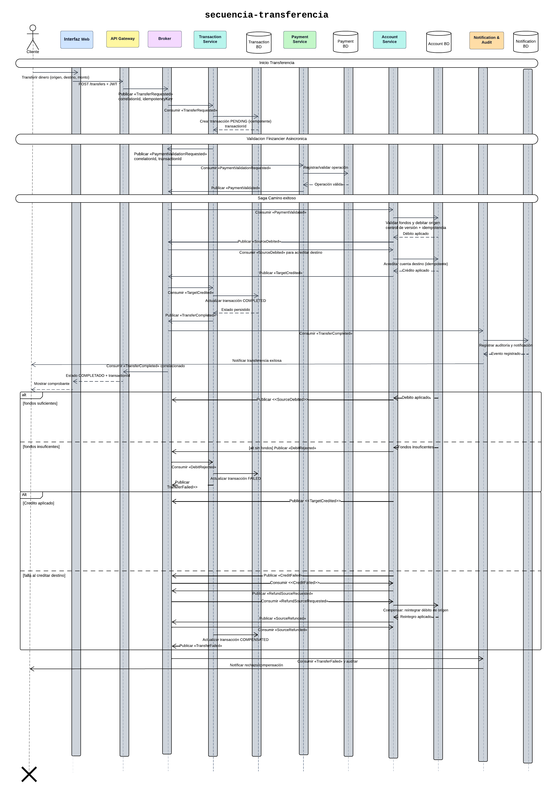

# Secuencia de transferencia bancaria

Flujo de transferencia, Saga, fallos y compensaciones.

La transferencia utiliza una Saga por coreografía, por lo que no existe un coordinador central ni llamadas directas entre microservicios. Cada servicio ejecuta su parte del proceso y publica el evento que activa el siguiente paso.
El cliente ingresa la cuenta de origen, la cuenta de destino y el monto. La interfaz envía la solicitud al API Gateway, que publica TransferRequested con el correlationId y la idempotencyKey.
Transaction Service consume la solicitud y crea una transacción con estado PENDING. Después publica PaymentValidationRequested. Payment Service consume este evento, valida y registra la operación financiera y, si es aceptada, publica PaymentValidated.
Account Service consume la validación, comprueba los fondos disponibles y debita la cuenta de origen utilizando controles de idempotencia y concurrencia. Cuando el débito se completa, publica SourceDebited. El mismo servicio consume posteriormente este evento y acredita el monto en la cuenta de destino, publicando TargetCredited.
Transaction Service consume TargetCredited, actualiza la transacción al estado COMPLETED y publica TransferCompleted. Notification & Audit Service registra el resultado y notifica al cliente. Finalmente, el Gateway consume el evento correlacionado y la interfaz muestra el comprobante.